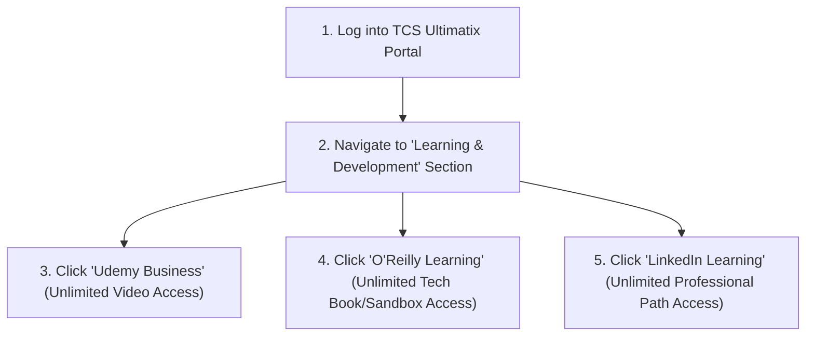

# Part 1: The 2026 Career Blueprint & TCS SAP CPQ Escape Plan

*[← Back to Master Index](/blog/it-career-guide)*

---

## 1. Introduction: The Strategy of Resource Curation

This blog post is not a technical tutorial. You will not find definitions of variables, syntax walkthroughs, or code snippets here. Instead, **this is your Master Source Directory**. 

When you are trapped in a legacy enterprise package role like **SAP CPQ (Configure, Price, Quote)** at a service-based giant like TCS, your biggest challenge is not a lack of coding tutorials. The internet is flooded with millions of tutorials, medium articles, and random YouTube videos. Your actual bottleneck is **information overload and dynamic legacy locking**. 

You do not need more generic tutorials. You need a **rigidly curated, hyper-vetted sequence of world-class educational sources** that tell you exactly:
- **Where** to go to learn each skill.
- **Which specific modules, chapters, or lectures** to consume.
- **Why** these sources are uniquely suited for your career pivot (video-first, free via TCS corporate access, hands-on).
- **How** to translate these courses directly into flagship portfolio projects.

By leveraging your free TCS corporate access to **Udemy Business, O'Reilly Learning, and LinkedIn Learning**, you can execute a world-class education curriculum entirely for free. This guide acts as your primary director, pointing you to the exact source documents, modules, and schedules to transition from TCS SAP CPQ support to an elite backend role commanding **₹8–10 LPA in India** (or **₹50 Lakhs to ₹1.25 Crore for international remote roles**).

---

## 2. Navigating Your TCS Corporate Portals (₹0 Upskilling Budget)

TCS provides its employees with full, unrestricted access to the world's best professional education portals. Before starting your curriculum, you must configure your corporate single sign-on (SSO) links to bypass all paywalls:

### A. Accessing Udemy Business
1. Log into your **TCS Ultimatix** portal.
2. Search the application directory for "Udemy" or "iON Learning".
3. Click the single sign-on (SSO) link to automatically generate your corporate account.
4. Download the "Udemy Business" mobile app on your phone and log in using your TCS corporate email credentials to enable offline viewing.

### B. Accessing O'Reilly Learning
1. Access the O'Reilly enterprise portal via your internal TCS library links or by visiting [oreilly.com/member/login](https://www.oreilly.com/member/login/) and entering your `@tcs.com` or `@tata.com` corporate email.
2. You will be redirected to the Ultimatix SSO gateway. Log in with your corporate credentials.
3. Once authenticated, install the "O'Reilly" mobile app. This will allow you to read every industry-standard tech book on your phone during your commutes or bench gaps.

---

## 3. The Master Source Directory: Escaping the Support Trap

Here are the precise learning resources, exact modules, and specific chapters you must consume to establish your core career blueprint, understand the backend engineering taxonomy, and escape the legacy CPQ ecosystem:

### Source 1: *The Software Engineer's Guidebook* by Gergely Orosz
*   **Format:** Digital/Physical Book
*   **Platform:** O'Reilly Learning (Search title inside your TCS O'Reilly account)
*   **Direct Link Reference:** [O'Reilly Book Profile Page](https://learning.oreilly.com/)
*   **Why It is Mandatory:** This is the definitive guide to modern tech industries. It maps out how product companies operate, how they evaluate developers, and how to build a high-performance career trajectory.

#### Exact Chapters to Read:
1.  **Read Part 1: The Career Path (Chapters 1–4):** Focus deeply on the distinctions between service-based software consultants, startup developers, and big-tech engineers. Use this section to map your target CTC hierarchy (transitioning from ₹3.36 LPA toward the target ₹8-10+ LPA brackets).
2.  **Read Part 5: Collaborating and Growing as an Engineer (Chapters 20–23):** Focus on the chapters describing code review cultures, documentation, and the daily habits of elite developers in product environments.

---

### Source 2: The *System Design Primer* by Donne Martin
*   **Format:** Open-Source Git Repository & Interactive Guide
*   **Platform:** GitHub (Free Public Access)
*   **Direct Link Reference:** [github.com/donnemartin/system-design-primer](https://github.com/donnemartin/system-design-primer)
*   **Why It is Mandatory:** This is the most famous, industry-standard source for understanding distributed systems. It provides clear, high-level architectures that will help you understand the "why" behind the database, networking, and system chapters in this blueprint.

#### Exact Sections to Read:
1.  **Read Section 1: Intro to System Design:** Focus on the core comparisons: Performance vs. Scalability, Latency vs. Throughput, and Availability vs. Consistency.
2.  **Read Section 2: Scale from zero to millions of users:** Focus on the step-by-step evolution of a basic web architecture into a multi-tier database-replicated, cached, globally distributed backend system.

---

### Source 3: *The Web Developer Bootcamp 2026* by Colt Steele
*   **Format:** Video Course (Interactive Code-Alongs)
*   **Platform:** Udemy Business (Search title inside your TCS Udemy account)
*   **Direct Link Reference:** [Udemy Course Page](https://www.udemy.com/)
*   **Why It is Selected:** Colt Steele is a master educator. If your coding skills are rusty or your resume contains fake skills, this course serves as the ultimate video-first "reboot." It builds your fundamental mental models of how internet browsers communicate with backend servers over HTTP protocols.

#### Exact Modules to Watch:
1.  **Watch Unit 1: Course Welcome & Developer Mindset (Lectures 1–5):** Essential for framing your study habits.
2.  **Watch Unit 15: Introduction to the Web & HTTP Requests (Lectures 140–152):** Focus heavily on learning the exact anatomy of an HTTP request: methods (GET, POST, PUT, DELETE), status codes (200, 301, 400, 404, 500), headers, and payloads.
3.  **Watch Unit 16: CSS Foundations (Lectures 153–165):** A quick refresher to ensure you can build basic responsive styling elements for your portfolio platforms.

---

### Source 4: *Programming Foundations: Fundamentals* by Annyce Davis
*   **Format:** Short-Form Video Course
*   **Platform:** LinkedIn Learning (Search title inside your TCS LinkedIn Learning account)
*   **Direct Link Reference:** [LinkedIn Learning Portal](https://www.linkedin.com/learning/)
*   **Why It is Selected:** A rapid, high-level structural framework to review primary programming paradigms (Object-Oriented, Functional) and common data structures without gettting bogged down in complex syntax.

#### Exact Sections to Watch:
1.  **Watch Module 2: Writing Code:** Focus on clean naming conventions, variables, and global/local variable scoping guidelines.
2.  **Watch Module 4: Object-Oriented Programming:** Master the conceptual definitions of encapsulation, inheritance, polymorphism, and abstraction.

---

## 4. Setting Up Your 10-Hour Upskilling Engine

To transition from a ₹3.36 LPA support role to an elite product engineer, you must dedicate **10 hours a day** to these sources. This requires transforming your daily routine, leveraging support shift gaps, and using "active recovery" strategies.

### The Source Study Plan

```mermaid
gantt
    title Detailed Study Allocation (10-Hour Routine)
    dateFormat  HH:mm
    axisFormat %H:%M
    section Morning
    O'Reilly Reading (Gergely Orosz) :07:00, 08:30
    Udemy Video Blocks (Colt Steele) :active, 08:30, 10:00
    section Work Shift
    TCS Shift Monitoring / System Design Primer : 10:00, 13:00
    Hands-On Lab Practice (Git Sandbox Setup) :active, 13:00, 17:00
    section Evening
    TCS Queue Sync & Wrap-Up : 17:00, 19:00
    LeetCode Foundations (NeetCode 150) :active, 19:00, 22:00
```

#### The Execution Metrics:
- **Video Playback Speed:** Always watch Udemy video lectures at **1.25x or 1.5x speed**. Use active pausing—pause the video to write down code locally, never copy-paste blindly.
- **Active Technical Notes:** Keep a local git repository named `upskilling-notes`. Write summaries of every O'Reilly chapter or video module you complete in markdown format. Push these daily to track your progress.
- **Leverage Shift Gaps:** In a TCS support shift (e.g. SAP CPQ configurations), keep your O'Reilly Reader open on a secondary monitor. Allocate every 15-minute gap between configurations to reading Gergely Orosz or the System Design Primer.

---

## 5. Portfolio Construction Strategy

You cannot clear backend interviews with a resume that says "SAP CPQ ticket resolver." You must build **irrefutable public proof of competence** using modern platforms. During this initial phase, you must configure your primary portfolio domains:

### Phase 1 Portfolio Checklist:
1.  **Configure GitHub Profile:** Create your official developer profile on [github.com](https://github.com/). Secure a clean username (e.g., `github.com/chirag127`).
2.  **Register Personal Domains:** Purchase and configure custom domain names (e.g., `chirag127.in` or `oriz.in`) via domains managers. Point them to your hosting environments (such as Cloudflare Pages).
3.  **Establish the Roadmap Page:** Create a structured `/roadmap` page on your personal site where you list this 25-part syllabus, demonstrating to recruiters that you are executing a rigorous, self-directed systems engineering curriculum.

---

## 6. Actionable Exit Tasks

To complete this chapter and proceed to Part 2, you must verify your access and confirm your upskilling engine is running:

- [ ] **TCS Ultimatix Audit:** Confirm single sign-on access to **Udemy Business**, **O'Reilly**, and **LinkedIn Learning** is fully functional.
- [ ] **Local Environment Setup:** Install Windows Terminal and configure your local workspace.
- [ ] **GitHub Account Configuration:** Create your developer profile and establish your `upskilling-notes` repository.
- [ ] **Read the Target Chapters:** Complete the exact chapters of *The Software Engineer's Guidebook* and *System Design Primer* outlined in this chapter.

---

*[Proceed to Part 2: Advanced Version Control & Git Mastery →](/blog/it-career-guide/part-02-git-github)*

---

### The 2026 IT Career Blueprint Series Navigation

- **[Master Index: The 2026 IT Career Blueprint](/blog/it-career-guide)**
- **Part 1:** [The Blueprint & Escape Plan →](/blog/it-career-guide/part-01-the-blueprint)
- **Part 2:** [Advanced Version Control & Git Mastery →](/blog/it-career-guide/part-02-git-github)
- **Part 3:** [The Elite Developer Toolkit & Workflows →](/blog/it-career-guide/part-03-developer-toolkit)
- **Part 4:** [Python Mastery from Scratch →](/blog/it-career-guide/part-04-python-mastery)
- **Part 5:** [Async programming & FastAPI Backend Services →](/blog/it-career-guide/part-05-async-python-fastapi)
- **Part 6:** [TypeScript & Node.js Backend Ecosystems →](/blog/it-career-guide/part-06-typescript-backend)
- **Part 7:** [Relational Databases & Advanced PostgreSQL →](/blog/it-career-guide/part-07-postgresql)
- **Part 8:** [NoSQL Databases (MongoDB & Redis Caching) →](/blog/it-career-guide/part-08-nosql-databases)
- **Part 9:** [Distributed Systems & Message Queues with Kafka →](/blog/it-career-guide/part-09-distributed-systems-kafka)
- **Part 10:** [System Design Principles & Scalable Architecture →](/blog/it-career-guide/part-10-system-design)
- **Part 11:** [Microservices Architecture Patterns →](/blog/it-career-guide/part-11-microservices)
- **Part 12:** [Docker & Containerization for Backend Developers →](/blog/it-career-guide/part-12-docker)
- **Part 13:** [Kubernetes & Container Orchestration →](/blog/it-career-guide/part-13-kubernetes)
- **Part 14:** [Continuous Integration & Deployment (CI/CD) with GitHub Actions →](/blog/it-career-guide/part-14-cicd)
- **Part 15:** [AWS Cloud & Serverless Architectures →](/blog/it-career-guide/part-15-aws-serverless)
- **Part 16:** [Front-End Mastery: React, Next.js & Client-Side Architectures →](/blog/it-career-guide/part-16-frontend-react)
- **Part 17:** [Generative AI & Large Language Models (LLM) Integration →](/blog/it-career-guide/part-17-genai-llms)
- **Part 18:** [Retrieval-Augmented Generation (RAG) & Vector Databases →](/blog/it-career-guide/part-18-rag-vector-db)
- **Part 19:** [AI Agents & Advanced Workflows with LangGraph →](/blog/it-career-guide/part-19-ai-agents-langgraph)
- **Part 20:** [Enterprise Security, Authentication & OWASP Top 10 →](/blog/it-career-guide/part-20-security-auth)
- **Part 21:** [Comprehensive Testing: Unit, Integration, & E2E Testing →](/blog/it-career-guide/part-21-testing)
- **Part 22:** [Data Structures & Algorithms (DSA) and LeetCode Blueprint →](/blog/it-career-guide/part-22-dsa-leetcode)
- **Part 23:** [Tech Interview Success: System Design & Behavioral STAR Method →](/blog/it-career-guide/part-23-tech-interviews)
- **Part 24:** [Global Remote Jobs and Freelancing Platforms →](/blog/it-career-guide/part-24-global-remote)
- **Part 25:** [Immigration, Visas & Tech Relocation →](/blog/it-career-guide/part-25-immigration-visas)
