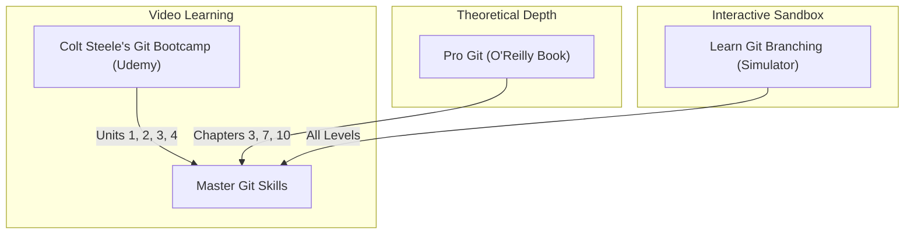

# Part 2: Advanced Version Control & Git Mastery

*[← Back to Master Index](/blog/it-career-guide)*

---

## 1. Introduction: Git is Your Collaborative Spine

In entry-level support roles, version control is often reduced to a few basic commands: dragging files into a UI, clicking a commit button, or using `git add .` and `git commit -m "fix"`. 

In high-concurrency backend engineering teams or international remote startups, **version control is an intricate, collaborative graph system**. A professional developer's Git history is treated as a highly detailed, clean, and chronological index of documentation. You are expected to rebase your feature branches cleanly, squash working commits, isolate cherry-picks, and recover lost commits without panic.

This chapter is your **Master Git Resource Directory**. Instead of explaining the theory, it points you to the exact video modules, O'Reilly chapters, interactive simulator games, and practical portfolios you must use to master Git from first principles.

---

## 2. Master Resource Directory: Git & Version Control

Here are the precise, highly vetted learning resources, specific sections, and interactive tools you must use to gain Git mastery:

---

### Source 1: *The Git & GitHub Bootcamp* by Colt Steele
*   **Format:** Comprehensive Video Course
*   **Platform:** Udemy Business (Free via your TCS Ultimatix SSO gateway)
*   **Direct Link Reference:** [Udemy Course Page](https://www.udemy.com/)
*   **Why It is Selected:** Colt Steele provides the most visual, easy-to-follow, yet technically comprehensive Git course on the market. It goes beyond the basics to cover Git internals, reflogs, and interactive rebasing.

#### Exact Course Modules to Watch & Execute:
1.  **Watch Unit 1: Git Essentials (All Lectures):** Build the core mental models of the working directory, staging area, and repositories.
2.  **Watch Unit 2: Next Level Git (All Lectures):** Focus heavily on learning the exact mechanics of `git diff` outputs, and mastering the differences between `git reset` (soft vs. mixed vs. hard) and `git revert`.
3.  **Watch Unit 3: GitHub & Collaboration (All Lectures):** Learn remote workflows, managing pull requests, and resolving team merge conflicts.
4.  **Watch Unit 4: The Tricky Bits (All Lectures):** This is the most critical module. You must master **Interactive Rebasing** (`git rebase -i` to pick, reword, squash, and fix up commits), **Git tags**, **Git internals (Blobs, Trees, Commits)**, and **Reflogs**.

---

### Source 2: *Pro Git* (2nd Edition) by Scott Chacon & Ben Straub
*   **Format:** Digital Technical Reference Book
*   **Platform:** O'Reilly Learning (Search inside your TCS O'Reilly account)
*   **Direct Link Reference:** [O'Reilly Book Profile Page](https://learning.oreilly.com/)
*   **Why It is Selected:** This is the official, definitive Bible of Git. While Colt Steele's videos establish your visual memory, Scott Chacon's book provides the absolute engineering depth regarding how Git's database operates under the hood.

#### Exact Chapters to Read:
1.  **Read Chapter 3: Git Branching:** Focus deeply on Section 3.2 (Basic Branching and Merging) and Section 3.6 (Rebasing). Pay close attention to the diagrams showing how the `HEAD` pointer moves across parent commits.
2.  **Read Chapter 7: Git Tools:** Read Section 7.3 (Stashing and Cleaning), Section 7.6 (Rewriting History - especially Interactive Rebasing), and Section 7.11 (Reflog).
3.  **Read Chapter 10: Git Internals:** Vetted systems engineers must understand the low-level representation of code. Read how Git stores content-addressable files in `.git/objects/` as SHA-1 hashes (Section 10.2: Plumbing and Porcelain).

---

### Source 3: *Learn Git Branching* (Gamified Sandbox)
*   **Format:** Interactive CLI Branch Simulator
*   **Platform:** Open-Source Web Simulator
*   **Direct Link Reference:** [learngitbranching.js.org](https://learngitbranching.js.org/)
*   **Why It is Vetted:** Reading or watching Git is not enough. This simulator provides a gamified, real-time command-line interface that visualizes how every Git command manipulates the Directed Acyclic Graph (DAG) commit tree.

#### Exact Levels to Complete:
1.  **Complete Main Levels: Introduction Sequence (1–4):** Core branching and merging.
2.  **Complete Ramp Up Sequence (1–4):** Pointer manipulation, switching branches, and standard rebasing.
3.  **Complete Moving Work Around Sequence (1–2):** Cherry-picking and interactive rebasing.
4.  **Complete To Infinity and Beyond Sequence (1–8):** Advanced push/pull coordination and track branch states.

---

## 3. Hands-On Portfolio Lab Project: The Git Sandbox

To prove to hiring managers that you understand professional workflows, you must build and showcase a **Git Sandbox Repository** on your GitHub account (`github.com/chirag127`).

### The Lab Project Guidelines:
1.  **Initialize a Repository:** Create a local folder `git-sandbox` and run `git init`.
2.  **Generate a Messy History:** Create a series of files and commit them with messy commit messages (e.g. `commit 1`, `WIP`, `typo fixed`, `debug added`, `actual feature`).
3.  **Perform Interactive Rebase:** Run `git rebase -i HEAD~5`. Edit your commit file, using `pick` for the main feature, `reword` to create a Conventional Commit message, `squash` to merge the WIP and schema changes, and `fixup` to silently absorb the typo and debug removals.
4.  **Simulate Disaster & Recovery:**
    - Run `git reset --hard HEAD~2` to intentionally delete your last two commits.
    - Run `git reflog`. Find the exact commit hash representing your clean state before the reset.
    - Run `git reset --hard \<hash\>` to recover your lost commits.
5.  **Configure Git Hooks:** Create a `.pre-commit-config.yaml` file in the root directory to enforce automated linting checks (using standard Python `pre-commit` packages).
6.  **Submit a Mock PR:** Push the repository to GitHub and write a detailed, professional Pull Request description detailing your interactive rebase process.

---

## 4. Technical Interview Self-Assessment

Use these questions to verify if you have successfully digested these learning sources:

| Concept | High-Frequency Interview Question | Expected Technical Answer Framework |
| :--- | :--- | :--- |
| **Commit Model** | Is a Git commit a diff or a snapshot? | It is a complete **snapshot** of the repository's tree structure. Unchanged files simple point to their pre-existing blob hashes, saving disk space. |
| **Rebase vs Merge** | When should you use `git rebase` instead of `git merge`? | Rebase replays your commits linearly on top of a target branch, creating a clean linear history. **Rule:** Never rebase public, shared branches, only local private branches. |
| **Resets** | What is the difference between `git reset --soft` and `git reset --hard`? | `--soft` moves the `HEAD` pointer but keeps your modified files staged in the index. `--hard` moves `HEAD` and completely wipes out all modifications in your working directory. |
| **Reflog** | How does `git reflog` recover deleted commits? | It logs every pointer update locally. As long as a commit was recorded locally, its SHA-1 hash exists in the objects database until garbage collected, allowing you to reset back to it. |

---

## 5. Exit Tasks for this Phase

Complete these verification steps before proceeding to Part 3:

- [ ] Complete all 4 selected modules of Colt Steele's Udemy course.
- [ ] Read the 3 targeted chapters in *Pro Git* via O'Reilly Business.
- [ ] Achieve 100% completion badge on *Learn Git Branching*.
- [ ] Push your completed `git-sandbox` repository to your GitHub profile with a detailed PR description.

---

*[Proceed to Part 3: The Elite Developer Toolkit & Workflows →](/blog/it-career-guide/part-03-developer-toolkit)*

---

### The 2026 IT Career Blueprint Series Navigation

- **[Master Index: The 2026 IT Career Blueprint](/blog/it-career-guide)**
- **Part 1:** [The Blueprint & Escape Plan →](/blog/it-career-guide/part-01-the-blueprint)
- **Part 2:** [Advanced Version Control & Git Mastery →](/blog/it-career-guide/part-02-git-github)
- **Part 3:** [The Elite Developer Toolkit & Workflows →](/blog/it-career-guide/part-03-developer-toolkit)
- **Part 4:** [Python Mastery from Scratch →](/blog/it-career-guide/part-04-python-mastery)
- **Part 5:** [Async programming & FastAPI Backend Services →](/blog/it-career-guide/part-05-async-python-fastapi)
- **Part 6:** [TypeScript & Node.js Backend Ecosystems →](/blog/it-career-guide/part-06-typescript-backend)
- **Part 7:** [Relational Databases & Advanced PostgreSQL →](/blog/it-career-guide/part-07-postgresql)
- **Part 8:** [NoSQL Databases (MongoDB & Redis Caching) →](/blog/it-career-guide/part-08-nosql-databases)
- **Part 9:** [Distributed Systems & Message Queues with Kafka →](/blog/it-career-guide/part-09-distributed-systems-kafka)
- **Part 10:** [System Design Principles & Scalable Architecture →](/blog/it-career-guide/part-10-system-design)
- **Part 11:** [Microservices Architecture Patterns →](/blog/it-career-guide/part-11-microservices)
- **Part 12:** [Docker & Containerization for Backend Developers →](/blog/it-career-guide/part-12-docker)
- **Part 13:** [Kubernetes & Container Orchestration →](/blog/it-career-guide/part-13-kubernetes)
- **Part 14:** [Continuous Integration & Deployment (CI/CD) with GitHub Actions →](/blog/it-career-guide/part-14-cicd)
- **Part 15:** [AWS Cloud & Serverless Architectures →](/blog/it-career-guide/part-15-aws-serverless)
- **Part 16:** [Front-End Mastery: React, Next.js & Client-Side Architectures →](/blog/it-career-guide/part-16-frontend-react)
- **Part 17:** [Generative AI & Large Language Models (LLM) Integration →](/blog/it-career-guide/part-17-genai-llms)
- **Part 18:** [Retrieval-Augmented Generation (RAG) & Vector Databases →](/blog/it-career-guide/part-18-rag-vector-db)
- **Part 19:** [AI Agents & Advanced Workflows with LangGraph →](/blog/it-career-guide/part-19-ai-agents-langgraph)
- **Part 20:** [Enterprise Security, Authentication & OWASP Top 10 →](/blog/it-career-guide/part-20-security-auth)
- **Part 21:** [Comprehensive Testing: Unit, Integration, & E2E Testing →](/blog/it-career-guide/part-21-testing)
- **Part 22:** [Data Structures & Algorithms (DSA) and LeetCode Blueprint →](/blog/it-career-guide/part-22-dsa-leetcode)
- **Part 23:** [Tech Interview Success: System Design & Behavioral STAR Method →](/blog/it-career-guide/part-23-tech-interviews)
- **Part 24:** [Global Remote Jobs and Freelancing Platforms →](/blog/it-career-guide/part-24-global-remote)
- **Part 25:** [Immigration, Visas & Tech Relocation →](/blog/it-career-guide/part-25-immigration-visas)
