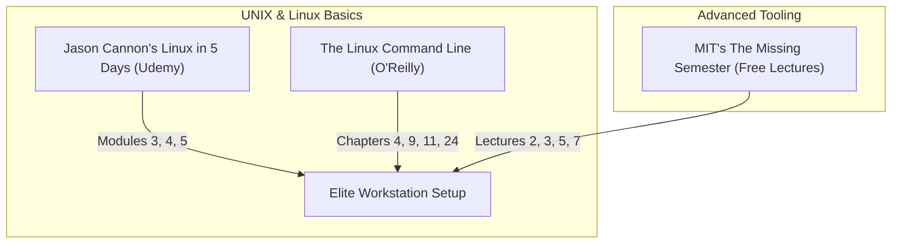

# Part 3: The Elite Developer Toolkit & Workflows

*[← Back to Master Index](/blog/it-career-guide)*

---

## 1. Introduction: The Command Line is Your Home

In standard support accounts, junior engineers are heavily mouse-dependent. They spend their days clicking buttons in complex Graphic User Interfaces (GUIs), dragging files across folders, and manually executing operations. 

In elite backend engineering teams or global remote startups, **the mouse is considered a fallback**. Professional developers write code, manage servers, configure databases, parse logs, and orchestrate systems entirely from the keyboard. They master the UNIX shell terminal, automate boring tasks with custom scripts, and touch-type at the speed of thought.

This chapter is your **Master Developer Toolkit Resource Directory**. It contains no generic scripting tutorials. Instead, it points you to the exact video courses, O'Reilly books, open MIT lectures, and configuration files you must use to transform your local Windows 11 machine into a world-class, high-performance UNIX workstation.

---

## 2. Master Resource Directory: Developer Toolkit

Here are the precise learning resources, specific sections, and video lectures you must utilize to configure your developer environment:

---

### Source 1: *Learn Linux in 5 Days* by Jason Cannon
*   **Format:** Vetted Video Course
*   **Platform:** Udemy Business (Free via your TCS Ultimatix SSO gateway)
*   **Direct Link Reference:** [Udemy Course Page](https://www.udemy.com/)
*   **Why It is Selected:** Jason Cannon provides a structured, high-level, and practical introduction to Linux. It is uniquely suited for users transitioning from Windows environments who need a rapid, video-first understanding of UNIX structures.

#### Exact Course Modules to Watch & Execute:
1.  **Watch Unit 3: Linux Fundamentals:** Learn how to read the standard Linux directory tree (`/etc`, `/var`, `/home`) and understand Zsh/Bash shells.
2.  **Watch Unit 4: Command Line Skills:** Master file permission schemes (`chmod` octal modes: 755, 644), utilizing pipes (`|`), standard redirects (`>`, `>>`, `2>`), and navigating file searches using `find`.
3.  **Watch Unit 5: System Management:** Master process controls (`ps`, `top`, backgrounding operations with `&`, suspending with `Ctrl + Z`, and terminating with `kill -9`).

---

### Source 2: *The Linux Command Line* (2nd Edition) by William Shotts
*   **Format:** Comprehensive Technical Reference Book
*   **Platform:** O'Reilly Learning (Search inside your TCS O'Reilly account)
*   **Direct Link Reference:** [O'Reilly Book Profile Page](https://learning.oreilly.com/)
*   **Why It is Selected:** Shotts' book is widely regarded as the ultimate guide to the UNIX shell. It goes deep into the configuration mechanics of the terminal environment, environment variable scopes, and advanced shell programming.

#### Exact Chapters to Read:
1.  **Read Chapter 4: Controlling the Shell:** Focus on terminal shortcut keys and standard navigation workflows.
2.  **Read Chapter 9: Permissions:** Learn how the operating system handles user groups, owner tags, and executable states.
3.  **Read Chapter 11: The Environment:** Master how variables are exported, stored inside `.bashrc` or `.zshrc` profiles, and inherited by child processes.
4.  **Read Chapter 24: Writing Your First Shell Script:** Learn the exact formatting constraints of **Bash Scripting** (variables, loops, conditionals, and exit codes).

---

### Source 3: *The Missing Semester of Your CS Education* by MIT
*   **Format:** Open-Access University Video Lecture Series & Labs
*   **Platform:** MIT CSAIL (Free Public Access)
*   **Direct Link Reference:** [missing.csail.mit.edu](https://missing.csail.mit.edu/)
*   **Why It is Selected:** Universities teach computer science theory, but they rarely teach the actual tools required to be a productive developer. This MIT course is the single best resource on the internet for mastering dotfiles, SSH keys, terminal multiplexers, fuzzy utilities, and touch-typing text editors (Vim).

#### Exact Lectures to Watch & Practice:
1.  **Watch Lecture 2: Shell Tools and Scripting:** Focus on pipelines, globbing, search utilities, and using modern replacements like `ripgrep` (`rg`).
2.  **Watch Lecture 3: Editors (Vim):** This is mandatory. You must complete the entire Vim tutor lab. Enable the Vim extension in VS Code/Cursor. Practice motions (`w`, `b`, `e`), changes (`ci"`, `ci(`, `diw`), and modes (Normal, Insert, Visual). **Touch-typing without a mouse is a non-negotiable trait of senior backend developers.**
3.  **Watch Lecture 5: Command-line Environment:** Learn how to configure custom command aliases, manage global environment variables via dotfiles, utilize terminal multiplexers (`tmux`), and set up SSH config files to jump onto remote servers instantly.

---

## 4. Hands-On Portfolio Lab Project: Env Bootstrapper

To demonstrate your tool competence to recruiters, you must build and commit an **Environment Bootstrapper Script** written in native Bash shell scripting to your public GitHub profile (`github.com/chirag127`).

### The Lab Project Guidelines:
1.  **Script File:** Create a file named `developer_bootstrap.sh`. Start with the standard shebang: `#!/usr/bin/env bash` and enable strict error handling: `set -eo pipefail`.
2.  **Directory Scaffolding:** Your script must automatically create a structured backend project workspace: `src/routers`, `src/schemas`, `tests`, `configs`.
3.  **Environment Setup:**
    - Initialize a Python virtual environment: `python3 -m venv .venv`.
    - Generate a secure, local `.env` configuration file populated with default variables (PORT, ENVIRONMENT, SECRET_KEY) using an automated heredoc block.
    - Generate a corresponding `.env.example` file.
4.  **Diagnostic Ping Check:** Your script must perform a network latency check against a target database port (simulating a database availability check) and write the results to a colorized log file (`setup_diagnostics.log`).
5.  **Executable Package:** Mark the script as executable (`chmod +x`) and document how to execute it in a clean `README.md` file using terminal markdown code blocks.

---

## 5. Technical Interview Self-Assessment

Use these questions to verify if you have successfully digested these learning sources:

| Concept | High-Frequency Interview Question | Expected Technical Answer Framework |
| :--- | :--- | :--- |
| **Permissions** | What does the command `chmod 755 script.sh` accomplish? | It changes the file permissions. The owner gets **Read, Write, and Execute (7)**. The group and others get **Read and Execute (5)**. |
| **Port Locking** | How do you identify which process is holding port 8000 using the CLI? | Run the command `lsof -i :8000` or `netstat -nlp | grep 8000`. You can then terminate the process using `kill -9 \<PID\>`. |
| **Vim Motions** | What is the fastest way in Vim keys to change the text inside double quotes? | Type the key sequence `ci"` (Change Inside Quotes). Vim will delete all text inside the quotes and switch to Insert Mode. |
| **Standard Redirect** | What is the difference between `>` and `>>`? | `>` overwrites the target file's content completely. `>>` appends new data to the bottom of the existing file. |

---

## 6. Exit Tasks for this Phase

Complete these verification steps before proceeding to Part 4:

- [ ] Complete Units 3, 4, and 5 of Jason Cannon's Linux course.
- [ ] Read the 4 targeted chapters in *The Linux Command Line* via O'Reilly.
- [ ] Watch the 4 targeted MIT *Missing Semester* lectures and practice Vim motions.
- [ ] Commit your executable `developer_bootstrap.sh` pipeline setup script to your GitHub profile.

---

*[Proceed to Part 4: Python Mastery from Scratch →](/blog/it-career-guide/part-04-python-mastery)*

---

### The 2026 IT Career Blueprint Series Navigation

- **[Master Index: The 2026 IT Career Blueprint](/blog/it-career-guide)**
- **Part 1:** [The Blueprint & Escape Plan →](/blog/it-career-guide/part-01-the-blueprint)
- **Part 2:** [Advanced Version Control & Git Mastery →](/blog/it-career-guide/part-02-git-github)
- **Part 3:** [The Elite Developer Toolkit & Workflows →](/blog/it-career-guide/part-03-developer-toolkit)
- **Part 4:** [Python Mastery from Scratch →](/blog/it-career-guide/part-04-python-mastery)
- **Part 5:** [Async programming & FastAPI Backend Services →](/blog/it-career-guide/part-05-async-python-fastapi)
- **Part 6:** [TypeScript & Node.js Backend Ecosystems →](/blog/it-career-guide/part-06-typescript-backend)
- **Part 7:** [Relational Databases & Advanced PostgreSQL →](/blog/it-career-guide/part-07-postgresql)
- **Part 8:** [NoSQL Databases (MongoDB & Redis Caching) →](/blog/it-career-guide/part-08-nosql-databases)
- **Part 9:** [Distributed Systems & Message Queues with Kafka →](/blog/it-career-guide/part-09-distributed-systems-kafka)
- **Part 10:** [System Design Principles & Scalable Architecture →](/blog/it-career-guide/part-10-system-design)
- **Part 11:** [Microservices Architecture Patterns →](/blog/it-career-guide/part-11-microservices)
- **Part 12:** [Docker & Containerization for Backend Developers →](/blog/it-career-guide/part-12-docker)
- **Part 13:** [Kubernetes & Container Orchestration →](/blog/it-career-guide/part-13-kubernetes)
- **Part 14:** [Continuous Integration & Deployment (CI/CD) with GitHub Actions →](/blog/it-career-guide/part-14-cicd)
- **Part 15:** [AWS Cloud & Serverless Architectures →](/blog/it-career-guide/part-15-aws-serverless)
- **Part 16:** [Front-End Mastery: React, Next.js & Client-Side Architectures →](/blog/it-career-guide/part-16-frontend-react)
- **Part 17:** [Generative AI & Large Language Models (LLM) Integration →](/blog/it-career-guide/part-17-genai-llms)
- **Part 18:** [Retrieval-Augmented Generation (RAG) & Vector Databases →](/blog/it-career-guide/part-18-rag-vector-db)
- **Part 19:** [AI Agents & Advanced Workflows with LangGraph →](/blog/it-career-guide/part-19-ai-agents-langgraph)
- **Part 20:** [Enterprise Security, Authentication & OWASP Top 10 →](/blog/it-career-guide/part-20-security-auth)
- **Part 21:** [Comprehensive Testing: Unit, Integration, & E2E Testing →](/blog/it-career-guide/part-21-testing)
- **Part 22:** [Data Structures & Algorithms (DSA) and LeetCode Blueprint →](/blog/it-career-guide/part-22-dsa-leetcode)
- **Part 23:** [Tech Interview Success: System Design & Behavioral STAR Method →](/blog/it-career-guide/part-23-tech-interviews)
- **Part 24:** [Global Remote Jobs and Freelancing Platforms →](/blog/it-career-guide/part-24-global-remote)
- **Part 25:** [Immigration, Visas & Tech Relocation →](/blog/it-career-guide/part-25-immigration-visas)
