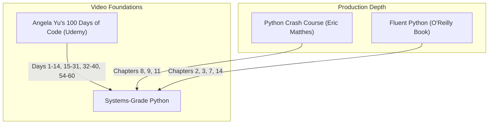

# Part 4: Python Mastery from Scratch

*[← Back to Master Index](/blog/it-career-guide)*

---

## 1. Introduction: Systems-Grade Python for Backend Development

Many dynamic language developers write Python like a basic scripting sandbox. They ignore type constraints, build massive memory allocations that cause server crashes, copy-paste decorators without understanding closures, and trigger memory leaks. 

In a high-performing backend systems engineering team or a cutting-edge Generative AI environment in **2026**, **Python is treated with strict architectural rigor**. You are expected to understand CPython memory pointer references, optimize data streams using generators, build custom context managers for connection safety, write type-safe decorators using advanced parameter specs, and compile with strict static type-checking.

This chapter is your **Master Python Resource Directory**. It does not contain basic coding tutorials. Instead, it points you to the exact video bootcamp modules, O'Reilly advanced chapters, and static typing configurations you must master to write systems-grade, high-performance Python.

---

## 2. Master Resource Directory: Python Programming

Here are the precise, vetted upskilling sources, specific chapter blocks, and video days you must consume:



---

### Source 1: *100 Days of Code: The Complete Python Pro Bootcamp* by Angela Yu
*   **Format:** Project-First Video Bootcamp
*   **Platform:** Udemy Business (Free via your TCS Ultimatix SSO gateway)
*   **Direct Link Reference:** [Udemy Course Page](https://www.udemy.com/)
*   **Why It is Selected:** Dr. Angela Yu provides the most comprehensive, project-driven Python course in existence. It forces you to write code by building 100 actual projects, preventing you from falling into "tutorial hell."

#### Exact Days and Modules to Complete:
1.  **Complete Days 1–14 (Beginner Python):** Establish solid execution habits. Master variables, control flow, functions, collection loops, and error handling.
2.  **Complete Days 15–31 (Intermediate Python & OOP):** Focus heavily on Object-Oriented Programming (OOP) architectures, custom class design, writing methods, inheritance, and handling local file operations.
3.  **Complete Days 32–40 (Intermediate Python & APIs):** Focus on connecting to web APIs, parsing JSON payloads using Python, and executing email automation scripts.
4.  **Complete Days 54–60 (Advanced Python & Web Frameworks):** Focus on the specific lectures explaining **Decorators** (`@decorator` syntax, decorators that accept arguments, and enclosing namespaces).

---

### Source 2: *Fluent Python* (2nd Edition) by Luciano Ramalho
*   **Format:** Deep-Dive Advanced Technical Book
*   **Platform:** O'Reilly Learning (Search inside your TCS O'Reilly account)
*   **Direct Link Reference:** [O'Reilly Book Profile Page](https://learning.oreilly.com/)
*   **Why It is Selected:** This is the undisputed gold standard for intermediate-to-advanced Python. It explains *how* the CPython interpreter behaves under the hood, how variable references are structured on the heap, and how to write elegant, idiomatic Python code.

#### Exact Chapters to Read:
1.  **Read Chapter 2 & 3: Data Structures:** Master sequence structures, lists, dictionaries, set optimizations, and hash table mappings.
2.  **Read Chapter 7: Decorators and Closures:** Focus on variable namespaces, the LEGB scope rules (Local, Enclosing, Global, Built-in), and writing functional closures.
3.  **Read Chapter 14: Iterators, Generators, and Classic Coroutines:** Learn how generators use the `yield` keyword to stream items one-by-one, keeping memory consumption constant (O(1) complexity).

---

### Source 3: *Python Crash Course* (3rd Edition) by Eric Matthes
*   **Format:** Fast-Paced Technical Book
*   **Platform:** O'Reilly Learning (Search inside your TCS O'Reilly account)
*   **Why It is Selected:** An excellent, practical handbook to rapidly refresh object-oriented patterns, class magic methods, and basic testing frameworks before you transition to async services.

#### Exact Chapters to Read:
1.  **Read Chapter 8 & 9: Functions & Classes:** Master constructors (`__init__`), class inheritance interfaces, and importing modules cleanly.
2.  **Read Chapter 11: Testing Your Code:** Master writing basic unit tests using Python's native `unittest` package.

---

### Source 4: *mypy* Static Type Safety Docs
*   **Format:** Official Documentation & Typings Guide
*   **Platform:** Open-Access Web Docs
*   **Direct Link Reference:** [mypy.readthedocs.io](https://mypy.readthedocs.io/)
*   **Why It is Vetted:** Python is dynamically typed at runtime, but modern backends require strict compile-time checks. The mypy docs explain how to configure strict checks to catch code bugs in local sandboxes.

#### Exact Settings to Configure:
Create a `pyproject.toml` file in your project root and enforce strict options:
```toml
[tool.mypy]
python_version = "3.11"
strict = true
disallow_untyped_defs = true
disallow_incomplete_defs = true
no_implicit_optional = true
warn_unused_ignores = true
```

---

## 4. Hands-On Portfolio Lab Project: Memory-Profiled CSV Pipeline

To prove your mastery of CPython memory management and strict typing to hiring managers, you must build and commit a **Memory-Profiled Data Streaming Pipeline** to your public GitHub profile (`github.com/chirag127`).

### The Lab Project Guidelines:
1.  **Data Generation:** Write a generator function `generate_mock_logs(count)` that yields synthetic log entries (dictionary nodes with ID, severity, message, timestamp) one-by-one.
2.  **Lazy Stream Consumer:** Write a function `filter_error_logs(stream)` that consumes the generator stream lazily. It must identify log items with a severity level of "ERROR", append their usernames to a list, and return it.
3.  **Type-Safe Timing Decorator:**
    - Write a custom decorator `@profile_pipeline` that wraps the filter function.
    - It must measure the start and end execution time using `time.perf_counter()` and print the duration.
    - **Strict Typing Constraint:** You must type-hint the decorator cleanly using the `ParamSpec` and `TypeVar` variables inside Python's native `typing` package, ensuring `mypy` can verify parameters.
4.  **Verification:** Execute type check validation:
    ```bash
    mypy --strict pipeline.py
    ```
    *Your script must compile successfully with zero type hints warnings or type resolution errors.*

---

## 5. Technical Interview Self-Assessment

Use these questions to verify if you have successfully digested these learning sources:

| Concept | High-Frequency Interview Question | Expected Technical Answer Framework |
| :--- | :--- | :--- |
| **Garbage Collection** | How does CPython reclaim memory for circular references? | While reference counting handles normal deallocation, circular cycles (Object A references B, B references A) are handled by a background **Generational Garbage Collector** that scans for unreachable cyclic loops. |
| **Decorator Wraps** | Why should you always use `@functools.wraps` inside custom decorators? | Because it copies the metadata (name, docstring, signature) of the original function onto the wrapper function, preventing debugging tools from losing the function details. |
| **Generators** | Why do generators prevent OOM (Out Of Memory) crashes in data streams? | Standard lists load all data into memory at once (O(N) memory complexity). Generators stream data one-by-one on demand via the `yield` keyword, maintaining a **constant memory footprint (O(1) memory)**. |
| **Scope (LEGB)** | What are Python's variable resolution rules? | Python searches exactly four scopes in sequence: **L**ocal, **E**nclosing (outer functions), **G**lobal (module level), and **B**uilt-in keywords. |

---

## 6. Exit Tasks for this Phase

Complete these verification steps before proceeding to Part 5:

- [ ] Complete all 4 selected Day blocks of Angela Yu's video bootcamp.
- [ ] Read the 3 targeted chapters in *Fluent Python* via O'Reilly.
- [ ] Read the 3 targeted chapters in *Python Crash Course* via O'Reilly.
- [ ] Push your type-safe, memory-profiled `pipeline.py` script to your GitHub profile, ensuring a clean `mypy` validation report.

---

*[Proceed to Part 5: Async programming & FastAPI Backend Services →](/blog/it-career-guide/part-05-async-python-fastapi)*

---

### The 2026 IT Career Blueprint Series Navigation

- **[Master Index: The 2026 IT Career Blueprint](/blog/it-career-guide)**
- **Part 1:** [The Blueprint & Escape Plan →](/blog/it-career-guide/part-01-the-blueprint)
- **Part 2:** [Advanced Version Control & Git Mastery →](/blog/it-career-guide/part-02-git-github)
- **Part 3:** [The Elite Developer Toolkit & Workflows →](/blog/it-career-guide/part-03-developer-toolkit)
- **Part 4:** [Python Mastery from Scratch →](/blog/it-career-guide/part-04-python-mastery)
- **Part 5:** [Async programming & FastAPI Backend Services →](/blog/it-career-guide/part-05-async-python-fastapi)
- **Part 6:** [TypeScript & Node.js Backend Ecosystems →](/blog/it-career-guide/part-06-typescript-backend)
- **Part 7:** [Relational Databases & Advanced PostgreSQL →](/blog/it-career-guide/part-07-postgresql)
- **Part 8:** [NoSQL Databases (MongoDB & Redis Caching) →](/blog/it-career-guide/part-08-nosql-databases)
- **Part 9:** [Distributed Systems & Message Queues with Kafka →](/blog/it-career-guide/part-09-distributed-systems-kafka)
- **Part 10:** [System Design Principles & Scalable Architecture →](/blog/it-career-guide/part-10-system-design)
- **Part 11:** [Microservices Architecture Patterns →](/blog/it-career-guide/part-11-microservices)
- **Part 12:** [Docker & Containerization for Backend Developers →](/blog/it-career-guide/part-12-docker)
- **Part 13:** [Kubernetes & Container Orchestration →](/blog/it-career-guide/part-13-kubernetes)
- **Part 14:** [Continuous Integration & Deployment (CI/CD) with GitHub Actions →](/blog/it-career-guide/part-14-cicd)
- **Part 15:** [AWS Cloud & Serverless Architectures →](/blog/it-career-guide/part-15-aws-serverless)
- **Part 16:** [Front-End Mastery: React, Next.js & Client-Side Architectures →](/blog/it-career-guide/part-16-frontend-react)
- **Part 17:** [Generative AI & Large Language Models (LLM) Integration →](/blog/it-career-guide/part-17-genai-llms)
- **Part 18:** [Retrieval-Augmented Generation (RAG) & Vector Databases →](/blog/it-career-guide/part-18-rag-vector-db)
- **Part 19:** [AI Agents & Advanced Workflows with LangGraph →](/blog/it-career-guide/part-19-ai-agents-langgraph)
- **Part 20:** [Enterprise Security, Authentication & OWASP Top 10 →](/blog/it-career-guide/part-20-security-auth)
- **Part 21:** [Comprehensive Testing: Unit, Integration, & E2E Testing →](/blog/it-career-guide/part-21-testing)
- **Part 22:** [Data Structures & Algorithms (DSA) and LeetCode Blueprint →](/blog/it-career-guide/part-22-dsa-leetcode)
- **Part 23:** [Tech Interview Success: System Design & Behavioral STAR Method →](/blog/it-career-guide/part-23-tech-interviews)
- **Part 24:** [Global Remote Jobs and Freelancing Platforms →](/blog/it-career-guide/part-24-global-remote)
- **Part 25:** [Immigration, Visas & Tech Relocation →](/blog/it-career-guide/part-25-immigration-visas)
