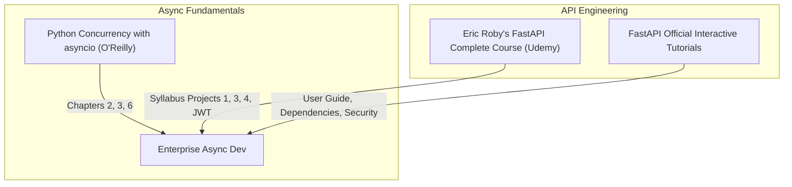

# Part 5: Async Programming & FastAPI Backend Services

*[← Back to Master Index](/blog/it-career-guide)*

---

## 1. Introduction: The Async Scale Revolution

In dynamic backend engineering, performance constraints are rarely CPU-bound; they are **I/O-bound**. When your server spends 95% of its execution time waiting for database queries to return or external APIs to respond, allocating a heavy operating system thread to block on each connection is a massive waste of resources.

Modern backend systems are built on **asynchronous, event-driven foundations**. By utilizing a single-threaded Event Loop that suspends paused tasks and processes others in parallel, you can build APIs that scale effortlessly. 

**FastAPI** is the industry standard for writing high-performance, asynchronous Python web backends in **2026**. By pairing native `asyncio` loop concepts with **Pydantic v2** validation and modern Dependency Injection configurations, FastAPI matches the performance of Go and Node.js.

This chapter is your **Master Asynchronous Python & FastAPI Resource Directory**. It contains no basic API scripting tutorials. Instead, it points you to the exact video bootcamp courses, advanced concurrency books, and interactive documentation paths you must master to build enterprise-grade async backend services.

---

## 2. Master Resource Directory: Async & FastAPI

Here are the precise learning resources, specific section tracks, and documentation modules you must utilize:



---

### Source 1: *FastAPI - The Complete Course (Beginner + Advanced)* by Eric Roby
*   **Format:** Hands-On Project Video Course
*   **Platform:** Udemy Business (Free via your TCS Ultimatix SSO gateway)
*   **Direct Link Reference:** [Udemy Course Page](https://www.udemy.com/)
*   **Why It is Selected:** Eric Roby provides a highly practical, step-by-step video curriculum. It bypasses abstract theories and guides you through building actual production-grade RESTful APIs integrated with SQLAlchemy, Alembic data migrations, and JWT token-based secure authorization systems.

#### Exact Course Modules to Watch & Execute:
1.  **Watch Section: FastAPI Request Method Logic (Project 1):** Master request validation parameters, query params, path structures, and standard Pydantic models.
2.  **Watch Section: Complete RESTful APIs (Project 3) & Database Integrations:** Vetted backend developers must know how to connect databases. Master configuring **SQLAlchemy ORM** connections, executing async operations, and sharing database sessions across dependencies.
3.  **Watch Section: Authentication & Authorization (JWT):** Master password hashing using BCrypt and signing/verifying **JSON Web Tokens (JWT)**.
4.  **Watch Section: Unit & Integration Testing (Project 4):** Master writing tests for asynchronous routers using `pytest`.

---

### Source 2: *Python Concurrency with asyncio* by Matthew Fowler
*   **Format:** Deep-Dive Advanced Technical Book
*   **Platform:** O'Reilly Learning (Search inside your TCS O'Reilly account)
*   **Direct Link Reference:** [O'Reilly Book Profile Page](https://learning.oreilly.com/)
*   **Why It is Selected:** Writing async code without understanding the event loop leads to silent locks. Fowler's book is the definitive, low-level guide explaining the CPython event loop, handling coroutine states, managing task cancellations, and offloading heavy blocking CPU operations using thread pools.

#### Exact Chapters to Read:
1.  **Read Chapter 2: The Core Event Loop and Coroutines:** Master the exact lifecycle of `async`, `await`, coroutines, tasks, and futures inside CPython's execution frames.
2.  **Read Chapter 3: Writing Asynchronous Web Servers:** Learn how low-level non-blocking sockets listen for requests and coordinate connections.
3.  **Read Chapter 6: CPU-bound Operations and Threads:** Master utilizing `asyncio.to_thread` or executors to process heavy computations without blocking your main event loop.

---

### Source 3: *FastAPI Official Documentation*
*   **Format:** Reference Guide & Interactive Manual
*   **Platform:** Open-Access Web Docs
*   **Direct Link Reference:** [fastapi.tiangolo.com](https://fastapi.tiangolo.com/)
*   **Why It is Vetted:** FastAPI's official documentation is widely recognized as one of the best technical manuals in the world. It provides rich code snippets, clear architectural concepts, and interactive Swagger UI playgrounds.

#### Exact Sections to Complete:
1.  **Complete Tutorial - User Guide (Intro to Advanced):** Focus heavily on the modern **`Annotated` type hint patterns** for injecting dependencies and validating fields.
2.  **Complete Section: Dependency Injection:** Vetted enterprise architectures rely on loose decoupling. Master using `Depends()` to share active database resources or parse headers.
3.  **Complete Section: Security:** Master OAuth2 with Password hashing, Bearer tokens, and JWT credentials validations.

---

### Source 4: *FastAPI Beyond CRUD* (YouTube Video Playlist)
*   **Format:** Advanced Video-First Playlist
*   **Platform:** YouTube (Free Public Access)
*   **Why It is Selected:** It bridges the gap between basic tutorials and enterprise repository patterns. It covers structuring large microservice folder trees, using asynchronous database session loaders, configuring Alembic database migration tools, and writing clean async pytest modules.

---

## 4. Hands-On Portfolio Lab Project: Async Diagnostics API

To prove to hiring managers that you can build reliable backend systems, you must build, test, and commit a **Strictly Typed, Async Diagnostic REST API** to your public GitHub profile (`github.com/chirag127`).

### The Lab Project Guidelines:
1.  **Project Directory Scaffolding:** Structure your repository using clean modular layers: `main.py`, `routers/`, `schemas/`, `configs/`, `tests/`.
2.  **Request Body Validation (Pydantic v2):**
    - Create a schema `DiagnosticRequestSchema` with constraints (e.g. alphanumeric names, floating-point metrics within strict bounds using Field annotations).
3.  **Async Path Routing (FastAPI):**
    - Create an endpoint `POST /api/diagnostics/evaluate` returning a clean response schema.
    - Write a simulated database validation dependency: `async def check_db_health() -> bool` that awaits a non-blocking delay: `await asyncio.sleep(0.05)`.
    - **Annotated Dependency Injection:** Inject the database check into the endpoint using the modern `Annotated[bool, Depends(check_db_health)]` syntax.
4.  **Asynchronous Test Suite:**
    - Write an async testing module inside `tests/test_metrics.py` using `pytest` and `pytest-asyncio`.
    - Use the modern `httpx.AsyncClient` wrapper to execute tests against your routers, verifying both valid requests (yielding 200 codes) and validation exceptions (yielding 422 codes).
5.  **Quality Enforcement:** Check your project using strict typing parameters:
    ```bash
    mypy --strict src/
    pytest tests/
    ```

---

## 5. Technical Interview Self-Assessment

Use these questions to verify if you have successfully digested these learning sources:

| Concept | High-Frequency Interview Question | Expected Technical Answer Framework |
| :--- | :--- | :--- |
| **Event Loop Block** | What happens if you call `time.sleep(5)` inside an `async def` FastAPI endpoint? | It freezes the entire single-threaded **event loop** for 5 seconds. The server cannot handle other active connections, causing performance degradation for all concurrent users. |
| **Pydantic v2 Core** | Why is Pydantic v2 significantly faster than v1? | Pydantic v2 shifted its core validation and serialization logic to a high-performance **Rust-powered engine (`pydantic-core`)**, achieving up to 20x speedups. |
| **Dependency Cache** | Does FastAPI resolve dependencies on every endpoint invocation? | By default, FastAPI **caches the results** of a dependency within a single request. If multiple sub-dependencies share a database connection dependency, they all reuse the same session object, reducing connection overhead. |
| **ASGI vs WSGI** | What is the difference between ASGI and WSGI servers? | WSGI is synchronous, thread-per-request (e.g. Gunicorn/Flask). ASGI is event-driven and supports concurrent asynchronous connections, websockets, and long-polling loops (e.g. Uvicorn/FastAPI). |

---

## 6. Exit Tasks for this Phase

Complete these verification steps before proceeding to Part 6:

- [ ] Complete the targeted modules and projects in Eric Roby's FastAPI video course.
- [ ] Read the 3 targeted chapters in Matthew Fowler's *asyncio* book.
- [ ] Watch the *FastAPI Beyond CRUD* playlist and complete the official documentation tutorials.
- [ ] Push your completed, tested, and strictly-typed `async-diagnostics-api` project to your GitHub profile, ensuring a clean `pytest` coverage report.

---

*[Proceed to Part 6: TypeScript & Node.js Backend Ecosystems →](/blog/it-career-guide/part-06-typescript-backend)*

---

### The 2026 IT Career Blueprint Series Navigation

- **[Master Index: The 2026 IT Career Blueprint](/blog/it-career-guide)**
- **Part 1:** [The Blueprint & Escape Plan →](/blog/it-career-guide/part-01-the-blueprint)
- **Part 2:** [Advanced Version Control & Git Mastery →](/blog/it-career-guide/part-02-git-github)
- **Part 3:** [The Elite Developer Toolkit & Workflows →](/blog/it-career-guide/part-03-developer-toolkit)
- **Part 4:** [Python Mastery from Scratch →](/blog/it-career-guide/part-04-python-mastery)
- **Part 5:** [Async programming & FastAPI Backend Services →](/blog/it-career-guide/part-05-async-python-fastapi)
- **Part 6:** [TypeScript & Node.js Backend Ecosystems →](/blog/it-career-guide/part-06-typescript-backend)
- **Part 7:** [Relational Databases & Advanced PostgreSQL →](/blog/it-career-guide/part-07-postgresql)
- **Part 8:** [NoSQL Databases (MongoDB & Redis Caching) →](/blog/it-career-guide/part-08-nosql-databases)
- **Part 9:** [Distributed Systems & Message Queues with Kafka →](/blog/it-career-guide/part-09-distributed-systems-kafka)
- **Part 10:** [System Design Principles & Scalable Architecture →](/blog/it-career-guide/part-10-system-design)
- **Part 11:** [Microservices Architecture Patterns →](/blog/it-career-guide/part-11-microservices)
- **Part 12:** [Docker & Containerization for Backend Developers →](/blog/it-career-guide/part-12-docker)
- **Part 13:** [Kubernetes & Container Orchestration →](/blog/it-career-guide/part-13-kubernetes)
- **Part 14:** [Continuous Integration & Deployment (CI/CD) with GitHub Actions →](/blog/it-career-guide/part-14-cicd)
- **Part 15:** [AWS Cloud & Serverless Architectures →](/blog/it-career-guide/part-15-aws-serverless)
- **Part 16:** [Front-End Mastery: React, Next.js & Client-Side Architectures →](/blog/it-career-guide/part-16-frontend-react)
- **Part 17:** [Generative AI & Large Language Models (LLM) Integration →](/blog/it-career-guide/part-17-genai-llms)
- **Part 18:** [Retrieval-Augmented Generation (RAG) & Vector Databases →](/blog/it-career-guide/part-18-rag-vector-db)
- **Part 19:** [AI Agents & Advanced Workflows with LangGraph →](/blog/it-career-guide/part-19-ai-agents-langgraph)
- **Part 20:** [Enterprise Security, Authentication & OWASP Top 10 →](/blog/it-career-guide/part-20-security-auth)
- **Part 21:** [Comprehensive Testing: Unit, Integration, & E2E Testing →](/blog/it-career-guide/part-21-testing)
- **Part 22:** [Data Structures & Algorithms (DSA) and LeetCode Blueprint →](/blog/it-career-guide/part-22-dsa-leetcode)
- **Part 23:** [Tech Interview Success: System Design & Behavioral STAR Method →](/blog/it-career-guide/part-23-tech-interviews)
- **Part 24:** [Global Remote Jobs and Freelancing Platforms →](/blog/it-career-guide/part-24-global-remote)
- **Part 25:** [Immigration, Visas & Tech Relocation →](/blog/it-career-guide/part-25-immigration-visas)
