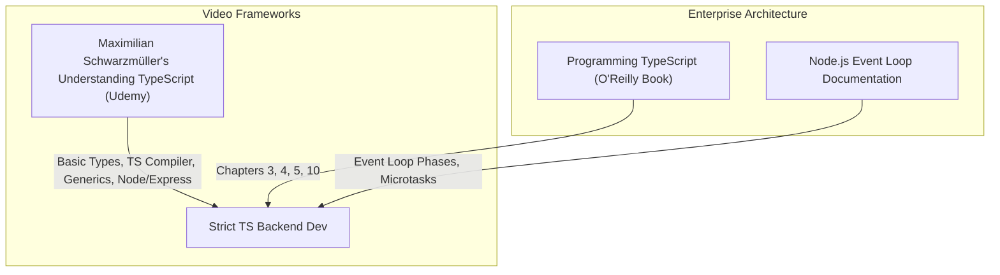

# Part 6: TypeScript & Node.js Backend Ecosystems

*[← Back to Master Index](/blog/it-career-guide)*

---

## 1. Introduction: Moving from Legacy JS to Strict TypeScript

In standard enterprise service accounts, JavaScript is often written in its most loose, dynamic form. You might see developers writing scripts in raw JavaScript with zero IDE type safety, ignoring compiler warnings, and copy-pasting code that frequently throws runtime crashes like `TypeError: Cannot read properties of undefined`. This dynamic unpredictability is why service companies spend thousands of hours manually debugging simple runtime type bugs.

In high-concurrency systems environments, startup web applications, and modern backend teams in **2026**, **runtime type errors are considered unacceptable**. Developers enforce **Strict TypeScript** at build-time. 

By running all code through the TypeScript Compiler (`tsc`) with the absolute strictest configuration options enabled, type bugs are caught immediately in the IDE before the code is ever committed to Git or pushed to production.

To become a highly sought-after full-stack backend engineer, you must master the Node.js asynchronous event loop, package workspaces using modern managers like `pnpm`, write strongly typed controllers using Express or Hono, compile your services cleanly, and validate incoming HTTP request payloads using validation schemas like **Zod**.

This chapter is your **TypeScript & Node.js Master Resource Directory**. It does not contain code tutorials. Instead, it points you to the exact video courses, O'Reilly deep-dives, and hands-on portfolio labs you must use to master strongly typed server-side development.

---

## 2. Master Resource Directory: TypeScript & Node.js

Here are the precise learning resources, specific syllabus modules, and O'Reilly chapters you must consume:



---

### Source 1: *Understanding TypeScript* by Maximilian Schwarzmüller
*   **Format:** Vetted Video Course (Project-First)
*   **Platform:** Udemy Business (Free via your TCS Ultimatix SSO gateway)
*   **Direct Link Reference:** [Udemy Course Page](https://www.udemy.com/)
*   **Why It is Selected:** Maximilian is one of the most structured educators in the web development space. This course is uniquely suited for developers who know basic JavaScript but need to transition into robust, enterprise-grade static typings, custom generic compilers, and decorators.

#### Exact Course Modules to Watch & Execute:
1.  **Watch Section: TypeScript Basics & Basic Types:** Master standard type annotations, type inference, tuples, enums, unions, literal types, and custom type aliases.
2.  **Watch Section: The TypeScript Compiler:** Learn how `tsc` parses your code, how to customize options inside your `tsconfig.json` file, and how to configure multi-file watch compiling scripts.
3.  **Watch Section: Advanced Types:** This is the most critical conceptual module. Master **Intersection Types**, **Type Guards**, **Discriminated Unions**, type casting, and index properties.
4.  **Watch Section: Generic Types:** Master writing reusable, highly flexible code structures using Generics (`<T>`), constraints (`extends`), and generic utility interfaces (`Partial`, `Readonly`).
5.  **Watch Section: Node.js + Express & TypeScript:** Master configuring an Express server natively inside a typed TypeScript module.

---

### Source 2: *Programming TypeScript* by Boris Cherny
*   **Format:** Deep-Dive Advanced Technical Book
*   **Platform:** O'Reilly Learning (Search inside your TCS O'Reilly account)
*   **Direct Link Reference:** [O'Reilly Book Profile Page](https://learning.oreilly.com/)
*   **Why It is Selected:** Boris Cherny is a former tech lead at Facebook. His book is the definitive bible for understanding TypeScript's type system from an academic, mathematical, and practical engineering perspective. It teaches you how to design complex, structural typings that protect your application's boundaries.

#### Exact Chapters to Read:
1.  **Read Chapter 3: All About Types:** Master how the TypeScript type checker evaluates types, checks compatibility, and processes values.
2.  **Read Chapter 4: Functions:** Learn how to type-hint function parameters, handle optional signatures, write function overloads, and structure polymorphic type definitions.
3.  **Read Chapter 5: Classes and Interfaces:** Master standard Object-Oriented patterns, access modifiers (`private`, `protected`, `public`), abstract classes, and implementation bounds.
4.  **Read Chapter 10: Namespaces and Modules:** Vetted developers must know how the compiler resolves imports. Master ESM (ES Modules) vs CJS (CommonJS) compilation pipelines.

---

### Source 3: *Node.js Official Documentation & Event Loop Guides*
*   **Format:** Open-Access Web Reference Manuals
*   **Platform:** Nodejs.org (Free Public Access)
*   **Direct Link Reference:** [nodejs.org/en/learn/asynchronous-work/event-loop-timers-and-nexttick](https://nodejs.org/en/learn/asynchronous-work/event-loop-timers-and-nexttick)
*   **Why It is Vetted:** You cannot write high-performance JavaScript backends without understanding how Node.js schedules code execution. This official guide explains the actual phases of the Node.js event loop.

#### Exact Concepts to Master:
1.  **The Event Loop Phases:** Learn the exact sequence: Timers (setTimeout) → Pending Callbacks → Idle, Prepare → Poll (incoming connections/data) → Check (setImmediate) → Close Callbacks.
2.  **Microtask Queue vs Macrotask Queue:** Master how `process.nextTick()` and `Promise.resolve()` (promises) are executed immediately after the current phase completes, taking priority over the standard poll queue.

---

## 3. Hands-On Portfolio Lab Project: Strongly Typed API with Zod

To demonstrate your enterprise TypeScript competence, you must build and commit a **Strictly Typed User Management REST API** to your public GitHub profile (`github.com/chirag127`).

### The Lab Project Guidelines:
1.  **Package Workspace Setup:**
    - Initialize your project using `pnpm`: `pnpm init`.
    - Configure your `package.json` to use ES Modules: `"type": "module"`.
2.  **Strict Compiler Configuration:**
    - Initialize the TypeScript compiler: `pnpm dlx tsc --init`.
    - Configure your `tsconfig.json` to enforce **maximum type safety**:
      ```json
      {
        "compilerOptions": {
          "target": "ES2022",
          "module": "NodeNext",
          "moduleResolution": "NodeNext",
          "strict": true,
          "noImplicitAny": true,
          "strictNullChecks": true,
          "noUnusedLocals": true,
          "noUnusedParameters": true,
          "noImplicitReturns": true,
          "outDir": "./dist"
        }
      }
      ```
3.  **Zod Schema Validation:**
    - Create a validation schema using **Zod** to validate incoming user requests (username min/max, valid emails, positive integer ages).
    - Extract the static TypeScript type interface dynamically from the Zod schema:
      ```typescript
      import { z } from 'zod';
      export const CreateUserSchema = z.object({ ... });
      export type CreateUserDTO = z.infer<typeof CreateUserSchema>;
      ```
4.  **Async Express Routing:**
    - Implement a route `POST /api/users` using Express.
    - Write a clean, asynchronous request handler that validates the request body against your Zod schema inside a try-catch block and throws formatted JSON validation errors if inputs fail.
5.  **Compilation & Execution Build:**
    - Configure a build script to compile your TypeScript cleanly to the `./dist` folder using the `tsc` compiler.
    - Verify that running `pnpm run build` runs successfully with zero type checking warnings.

---

## 4. Technical Interview Self-Assessment

Use these questions to verify if you have successfully digested these learning sources:

| Concept | High-Frequency Interview Question | Expected Technical Answer Framework |
| :--- | :--- | :--- |
| **Type vs Interface** | What is the difference between an `interface` and a `type` alias? | Interfaces support **declaration merging** (can be declared multiple times to append fields) and are strictly for object structures. Type aliases are more flexible, supporting unions, intersections, and primitives, but do not support merging. |
| **Discriminated Union**| What is a Discriminated Union, and why is it useful? | It is a union of object structures that all share a common, literal-typed property (the "discriminant"). The type checker uses this shared field to exhaustively narrow down structural types inside conditionals. |
| **Event Loop** | How does Node.js resolve `process.nextTick()` and Promises? | They are processed inside the **Microtask Queue**. When the current phase of the event loop completes, the engine immediately drains the microtask queue before moving to the next loop phase, taking priority over standard timers. |
| **Strict Compiler** | Why is `noImplicitAny` important inside a `tsconfig.json`? | It prevents the compiler from silently inferring the dynamic `any` type when no type is specified, forcing developers to declare strict type contracts. |

---

## 5. Exit Tasks for this Phase

Complete these verification steps before proceeding to Part 7:

- [ ] Complete all 5 selected sections of Maximilian's TypeScript course.
- [ ] Read the 4 targeted chapters in Boris Cherny's *Programming TypeScript* via O'Reilly.
- [ ] Read the official Node.js Event Loop Timers guide.
- [ ] Commit your type-safe, Zod-validated Express backend project to your GitHub profile, ensuring compilation compiles successfully under strict `tsconfig` parameters.

---

*[Proceed to Part 7: Relational Databases & Advanced PostgreSQL →](/blog/it-career-guide/part-07-postgresql)*

---

### The 2026 IT Career Blueprint Series Navigation

- **[Master Index: The 2026 IT Career Blueprint](/blog/it-career-guide)**
- **Part 1:** [The Blueprint & Escape Plan →](/blog/it-career-guide/part-01-the-blueprint)
- **Part 2:** [Advanced Version Control & Git Mastery →](/blog/it-career-guide/part-02-git-github)
- **Part 3:** [The Elite Developer Toolkit & Workflows →](/blog/it-career-guide/part-03-developer-toolkit)
- **Part 4:** [Python Mastery from Scratch →](/blog/it-career-guide/part-04-python-mastery)
- **Part 5:** [Async programming & FastAPI Backend Services →](/blog/it-career-guide/part-05-async-python-fastapi)
- **Part 6:** [TypeScript & Node.js Backend Ecosystems →](/blog/it-career-guide/part-06-typescript-backend)
- **Part 7:** [Relational Databases & Advanced PostgreSQL →](/blog/it-career-guide/part-07-postgresql)
- **Part 8:** [NoSQL Databases (MongoDB & Redis Caching) →](/blog/it-career-guide/part-08-nosql-databases)
- **Part 9:** [Distributed Systems & Message Queues with Kafka →](/blog/it-career-guide/part-09-distributed-systems-kafka)
- **Part 10:** [System Design Principles & Scalable Architecture →](/blog/it-career-guide/part-10-system-design)
- **Part 11:** [Microservices Architecture Patterns →](/blog/it-career-guide/part-11-microservices)
- **Part 12:** [Docker & Containerization for Backend Developers →](/blog/it-career-guide/part-12-docker)
- **Part 13:** [Kubernetes & Container Orchestration →](/blog/it-career-guide/part-13-kubernetes)
- **Part 14:** [Continuous Integration & Deployment (CI/CD) with GitHub Actions →](/blog/it-career-guide/part-14-cicd)
- **Part 15:** [AWS Cloud & Serverless Architectures →](/blog/it-career-guide/part-15-aws-serverless)
- **Part 16:** [Front-End Mastery: React, Next.js & Client-Side Architectures →](/blog/it-career-guide/part-16-frontend-react)
- **Part 17:** [Generative AI & Large Language Models (LLM) Integration →](/blog/it-career-guide/part-17-genai-llms)
- **Part 18:** [Retrieval-Augmented Generation (RAG) & Vector Databases →](/blog/it-career-guide/part-18-rag-vector-db)
- **Part 19:** [AI Agents & Advanced Workflows with LangGraph →](/blog/it-career-guide/part-19-ai-agents-langgraph)
- **Part 20:** [Enterprise Security, Authentication & OWASP Top 10 →](/blog/it-career-guide/part-20-security-auth)
- **Part 21:** [Comprehensive Testing: Unit, Integration, & E2E Testing →](/blog/it-career-guide/part-21-testing)
- **Part 22:** [Data Structures & Algorithms (DSA) and LeetCode Blueprint →](/blog/it-career-guide/part-22-dsa-leetcode)
- **Part 23:** [Tech Interview Success: System Design & Behavioral STAR Method →](/blog/it-career-guide/part-23-tech-interviews)
- **Part 24:** [Global Remote Jobs and Freelancing Platforms →](/blog/it-career-guide/part-24-global-remote)
- **Part 25:** [Immigration, Visas & Tech Relocation →](/blog/it-career-guide/part-25-immigration-visas)
