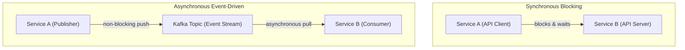
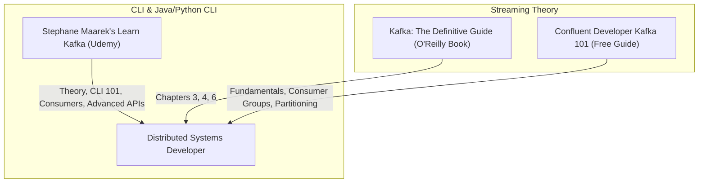

# Part 9: Distributed Systems & Event-Driven Architecture with Kafka

*[← Back to Master Index](/blog/it-career-guide)*

---

## 1. Introduction: The Event-Driven Scalability Paradigm

In standard web applications, microservices communicate with each other using **Synchronous REST APIs**. When Service A needs to notify Service B about a user purchase, it sends an HTTP POST request and blocks, waiting for a response. If Service B is slow, encounters a network bottleneck, or goes down completely, the entire user transaction freezes, leading to cascading system failures across the platform.

In high-scale systems, real-time analytics platforms, and enterprise microservice architectures in **2026**, **systems are built on Asynchronous, Event-Driven Foundations using Apache Kafka**. 

Instead of waiting for downstream services, producers publish events (like "Order Created") to highly durable, partitioned log streams (Topics) in milliseconds. Downstream consumer groups subscribe to these streams, reading and processing events at their own pace. Even if the consumer system goes down for hours, the logs persist inside the broker, allowing the consumer to pick up exactly where it left off upon recovery.

To land a high-paying distributed systems role, you must master the architecture of Apache Kafka (brokers, partitions, replications, offsets), consumer group rebalancing, write pipelines, and data durability guarantees.

This chapter is your **Apache Kafka & Distributed Systems Master Resource Directory**. It contains no basic coding tutorials. Instead, it points you to the exact video bootcamps, O'Reilly textbooks, and open certification sandboxes you must use to master event-driven architecture.

---

## 2. Master Resource Directory: Apache Kafka & Distributed Systems

Here are the precise learning resources, specific syllabus modules, and technical chapters you must consume:

---

### Source 1: *Apache Kafka Series - Learn Apache Kafka for Beginners v3* by Stephane Maarek
*   **Format:** Vetted Video Course (Practical Demos)
*   **Platform:** Udemy Business (Free via your TCS Ultimatix SSO gateway)
*   **Direct Link Reference:** [Udemy Course Page](https://www.udemy.com/)
*   **Why It is Selected:** Stephane is the most famous instructor in the Apache Kafka space. His course is highly practical, guiding you from low-level command-line broker configurations to writing robust, asynchronous consumer group loops in Python or Java.

#### Exact Course Modules to Watch & Execute:
1.  **Watch Section: Kafka Theory:** Master how **Brobers**, **Topics**, **Partitions**, and **Message Keys** operate dynamically to guarantee parallel write scalability and strict in-order message execution.
2.  **Watch Section: CLI (Command Line Interface) 101:** You must master the command line. Master configuring topics using `kafka-topics`, pushing messages via `kafka-console-producer`, and executing consumers with `kafka-console-consumer`.
3.  **Watch Section: Kafka Java/Python Programming 101:** Master writing asynchronous message producers and consumer group listener loops with graceful shutdown mechanisms.
4.  **Watch Section: Extended APIs (Advanced):** Learn high-level architectures: **Kafka Connect** (ingesting data from databases to Kafka without writing code), **Kafka Streams** (real-time stream aggregates), and the **Schema Registry** (enforcing Avro structures).

---

### Source 2: *Kafka: The Definitive Guide* (2nd Edition) by Gwen Shapira et al.
*   **Format:** Deep-Dive Technical Book
*   **Platform:** O'Reilly Learning (Search inside your TCS O'Reilly account)
*   **Direct Link Reference:** [O'Reilly Book Profile Page](https://learning.oreilly.com/)
*   **Why It is Selected:** Written by the core contributors of the Apache Kafka open-source project. This book provides the absolute lowest-level details regarding how brokers write segment files to physical disks, how replications are managed across clusters, and how consumer groups commit offsets safely.

#### Exact Chapters to Read:
1.  **Read Chapter 3: Kafka Producers:** Master writing message structures, understanding serialization, and configuring custom partitions.
2.  **Read Chapter 4: Kafka Consumers:** Focus on the internals of **Consumer Groups**, offset commit management (auto vs. manual commits), and how **Group Coordinators** trigger partition rebalances.
3.  **Read Chapter 6: Reliable Data Delivery:** Learn data safety parameters. Master configuring `acks=all`, tracking **In-Sync Replicas (ISR)**, and preventing data loss under broker failure.

---

### Source 3: *Confluent Developer Kafka 101*
*   **Format:** Interactive Video & Web Certification Path
*   **Platform:** Confluent Developer Portal (Free Public Access)
*   **Direct Link Reference:** [developer.confluent.io](https://developer.confluent.io/)
*   **Why It is Vetted:** Confluent was founded by the original creators of Apache Kafka. This portal is the gold standard free resource on the internet, offering incredibly visual animations, code sandbox labs, and clear system architecture tutorials.

#### Exact Curriculums to Complete:
1.  **Complete Course: Event Streaming Fundamentals:** Learn the primary patterns of stateful vs. stateless event logs.
2.  **Complete Course: Kafka Architecture & Consumer Groups:** Master how consumer groups scale by partitioning topics, and how partition count limits parallel scalability.

---

## 3. Hands-On Portfolio Lab Project: Real-Time Event Pipeline

To prove your distributed systems capabilities to recruiters, you must build and commit a **Real-Time Telemetry Event Streaming Pipeline** to your public GitHub profile (`github.com/chirag127`).

### The Lab Project Guidelines:
1.  **Distributed Infrastructure (Docker):** Build a `docker-compose.yml` file spinning up a **single-node Kafka Broker in KRaft mode** (bypassing legacy Zookeeper setups).
2.  **Partioned Topic Creation:** Configure your compose file or write a script to automatically pre-create a topic `system.telemetry` configured with **exactly 3 Partitions** and a replication factor of 1.
3.  **Event Data Producer:**
    - Write a script `producer.py` or `producer.ts` that queries system resource metrics (CPU, memory, timestamp) in a loop every 1 second.
    - It must publish these JSON events to your Kafka topic, using the `service_name` string as the **Message Routing Key** to guarantee that events for a specific service always land in the exact same partition in chronological order.
4.  **Parallel Consumer Group:**
    - Write a consumer script `consumer.py` or `consumer.ts` configured with a shared consumer group ID `telemetry-processor-group`.
    - **Step A:** Open three separate terminal tabs. Launch the consumer script in all three terminals concurrently (simulating 3 parallel worker threads).
    - **Step B:** Observe the console logs. Note how Kafka dynamically performs a **Rebalance**, allocating exactly 1 partition to each active consumer thread.
    - **Step C:** Stop one consumer using `Ctrl + C`. Verify that your script catches `SIGTERM` signals, **commits offsets manually and gracefully**, and triggers a rebalance so the remaining two consumers absorb the orphan partition without data loss.

---

## 4. Technical Interview Self-Assessment

Use these questions to verify if you have successfully digested these learning sources:

| Concept | High-Frequency Interview Question | Expected Technical Answer Framework |
| :--- | :--- | :--- |
| **Kafka Speed** | How does Kafka achieve extremely high write throughput on physical disks? | It writes data in an **Append-Only Sequential Log** structure, bypassing slow random disk seeks. It also utilizes **Zero-Copy OS optimizations**, transferring network packets from the page cache directly to the network card without context-switching to user space. |
| **Rebalance Anomaly**| What is a Consumer Group Rebalance, and why is it expensive? | A rebalance occurs when a consumer joins or leaves a group, forcing the Group Coordinator broker to re-allocate partitions. It is expensive because it pauses message processing for the entire group during the re-allocation window. |
| **Offsets** | What is the difference between `auto.commit.enable=true` and manual commits? | Auto commit periodically commits offsets in the background, risking **data duplication or loss** if a consumer crashes mid-transaction. Manual commits (`commitSync` or `commitAsync`) guarantee offsets are committed only after the message is processed successfully. |
| **Delivery Semantics**| Explain the difference between At-Least-Once and Exactly-Once delivery. | **At-Least-Once:** Messages are processed, but failures might trigger retries, duplicating writes. **Exactly-Once (EOS):** Utilizes transactional producers and atomic offset commits, guaranteeing data writes execute once, even under system failures. |

---

## 5. Exit Tasks for this Phase

Complete these verification steps before proceeding to Part 10:

- [ ] Complete the targeted modules and CLI tasks of Stephane Maarek's Kafka course.
- [ ] Read Chapters 3, 4, and 6 in *Kafka: The Definitive Guide* via O'Reilly.
- [ ] Complete the *Event Streaming* and *Architecture* courses on Confluent Developer.
- [ ] Commit your containerized, 3-partitioned `kafka-telemetry-pipeline` project to your GitHub profile, showing parallel consumer logs.

---

*[Proceed to Part 10: System Design Principles & Scalable Architecture →](/blog/it-career-guide/part-10-system-design)*

---

### The 2026 IT Career Blueprint Series Navigation

- **[Master Index: The 2026 IT Career Blueprint](/blog/it-career-guide)**
- **Part 1:** [The Blueprint & Escape Plan →](/blog/it-career-guide/part-01-the-blueprint)
- **Part 2:** [Advanced Version Control & Git Mastery →](/blog/it-career-guide/part-02-git-github)
- **Part 3:** [The Elite Developer Toolkit & Workflows →](/blog/it-career-guide/part-03-developer-toolkit)
- **Part 4:** [Python Mastery from Scratch →](/blog/it-career-guide/part-04-python-mastery)
- **Part 5:** [Async programming & FastAPI Backend Services →](/blog/it-career-guide/part-05-async-python-fastapi)
- **Part 6:** [TypeScript & Node.js Backend Ecosystems →](/blog/it-career-guide/part-06-typescript-backend)
- **Part 7:** [Relational Databases & Advanced PostgreSQL →](/blog/it-career-guide/part-07-postgresql)
- **Part 8:** [NoSQL Databases (MongoDB & Redis Caching) →](/blog/it-career-guide/part-08-nosql-databases)
- **Part 9:** [Distributed Systems & Message Queues with Kafka →](/blog/it-career-guide/part-09-distributed-systems-kafka)
- **Part 10:** [System Design Principles & Scalable Architecture →](/blog/it-career-guide/part-10-system-design)
- **Part 11:** [Microservices Architecture Patterns →](/blog/it-career-guide/part-11-microservices)
- **Part 12:** [Docker & Containerization for Backend Developers →](/blog/it-career-guide/part-12-docker)
- **Part 13:** [Kubernetes & Container Orchestration →](/blog/it-career-guide/part-13-kubernetes)
- **Part 14:** [Continuous Integration & Deployment (CI/CD) with GitHub Actions →](/blog/it-career-guide/part-14-cicd)
- **Part 15:** [AWS Cloud & Serverless Architectures →](/blog/it-career-guide/part-15-aws-serverless)
- **Part 16:** [Front-End Mastery: React, Next.js & Client-Side Architectures →](/blog/it-career-guide/part-16-frontend-react)
- **Part 17:** [Generative AI & Large Language Models (LLM) Integration →](/blog/it-career-guide/part-17-genai-llms)
- **Part 18:** [Retrieval-Augmented Generation (RAG) & Vector Databases →](/blog/it-career-guide/part-18-rag-vector-db)
- **Part 19:** [AI Agents & Advanced Workflows with LangGraph →](/blog/it-career-guide/part-19-ai-agents-langgraph)
- **Part 20:** [Enterprise Security, Authentication & OWASP Top 10 →](/blog/it-career-guide/part-20-security-auth)
- **Part 21:** [Comprehensive Testing: Unit, Integration, & E2E Testing →](/blog/it-career-guide/part-21-testing)
- **Part 22:** [Data Structures & Algorithms (DSA) and LeetCode Blueprint →](/blog/it-career-guide/part-22-dsa-leetcode)
- **Part 23:** [Tech Interview Success: System Design & Behavioral STAR Method →](/blog/it-career-guide/part-23-tech-interviews)
- **Part 24:** [Global Remote Jobs and Freelancing Platforms →](/blog/it-career-guide/part-24-global-remote)
- **Part 25:** [Immigration, Visas & Tech Relocation →](/blog/it-career-guide/part-25-immigration-visas)
