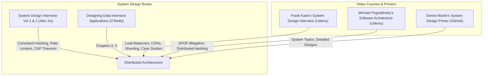

# Part 10: System Design Principles & Scalable Architecture

*[← Back to Master Index](/blog/it-career-guide)*

---

## 1. Introduction: The Architecture of Scale

Many junior engineers think backend development is solely about writing lines of code inside single web frameworks. They write endpoints that query databases directly, run all tasks sequentially, keep all application states locally in-memory, and assume the server will run fine. 

However, as traffic scales from a few users to millions of concurrent requests, single-node application architectures collapse under physical CPU, memory, and database connection limits.

In high-concurrency systems environments, enterprise tech giants, and global remote organizations in **2026**, **System Design is the ultimate technical separator**. Developers are evaluated on their ability to architect distributed, highly scalable, and fault-tolerant systems. 

You must master the concepts of load balancing, Content Delivery Networks (CDNs), consistent hashing, database partitioning, database sharding, caching topologies, replication strategies, and the CAP theorem.

This chapter is your **System Design & Scalable Architecture Master Resource Directory**. It contains no basic coding tutorials. Instead, it points you to the exact systems books, video architecture courses, and open repositories you must master to design enterprise-scale systems.

---

## 2. Master Resource Directory: System Design & Scalability

Here are the precise learning resources, specific syllabus modules, and technical chapters you must consume:

---

### Source 1: *System Design Interview - An Insider's Guide* (Vol 1 & 2) by Alex Xu
*   **Format:** Vetted Systems Book (Highly Visual)
*   **Platform:** ByteByteGo (Search inside your local library or book portals)
*   **Why It is Selected:** Alex Xu provides the most famous, highly structured, and diagram-heavy guide on the market. It explains advanced system design patterns through concrete, real-world case studies (e.g. designing rate limiters, key-value stores, web crawlers).

#### Exact Chapters to Read:
1.  **Read Volume 1, Chapter 1: Scale From Zero To Millions of Users:** Focus on the chronological progression from single servers to database replicas, caches, load balancers, and multi-region setups.
2.  **Read Volume 1, Chapter 4: Design a Rate Limiter:** Master the core algorithms: Token Bucket, Leaky Bucket, and Sliding Window Log.
3.  **Read Volume 1, Chapter 5: Design Consistent Hashing:** Vetted backend engineers must master consistent hashing. Study how virtual nodes are mapped on a hash ring to prevent cache stampedes during scaling.
4.  **Read Volume 1, Chapter 6: Design a Key-Value Store:** Focus on the CAP Theorem, Vector Clocks, and Quorum Consensus ($W + R > N$).

---

### Source 2: *Mastering the System Design Interview* by Frank Kane
*   **Format:** Hands-On Video Course
*   **Platform:** Udemy Business (Free via your TCS Ultimatix SSO gateway)
*   **Direct Link Reference:** [Udemy Course Page](https://www.udemy.com/)
*   **Why It is Selected:** Frank Kane is an ex-Amazon tech lead. His course is uniquely suited for video-centric learners, explaining the practical tradeoffs of load balancers, caching layers, and database sharding through actual, whiteboard-style architectural walk-throughs.

#### Exact Course Modules to Watch & Execute:
1.  **Watch Section: System Design Basics:** Master vertical vs. horizontal scaling, stateless architectures, and load-balancing algorithms (Round Robin, Least Connections).
2.  **Watch Section: Database Scaling:** Master master-slave replication, database partitioning, and database sharding techniques.
3.  **Watch Section: Case Studies:** Review the walk-throughs for designing a URL shortener, a social network news feed, and a distributed web crawler.

---

### Source 3: *Software Architecture & Design of Modern Large-Scale Systems* by Michael Pogrebinsky
*   **Format:** Advanced Video Course
*   **Platform:** Udemy Business (Free via your TCS Ultimatix SSO gateway)
*   **Why It is Selected:** Michael focuses on software engineering patterns and reliability metrics. He teaches you how to design distributed microservices, handle partial network failures, and build resilient messaging layers.

#### Exact Course Modules to Watch & Execute:
1.  **Watch Section: Software Design Metrics:** Master measuring latency, throughput, availability, and identifying Single Points of Failure (SPOF).
2.  **Watch Section: Database Replication & Sharding:** Learn how to configure sharding keys and manage distributed data transactions.

---

### Source 4: *Designing Data-Intensive Applications* by Martin Kleppmann
*   **Format:** Technical Systems Architecture Book
*   **Platform:** O'Reilly Learning (Search inside your TCS O'Reilly account)
*   **Direct Link Reference:** [O'Reilly Book Profile Page](https://learning.oreilly.com/)
*   **Why It is Vetted:** The definitive reference book for backend developers. To build large-scale distributed systems, you must read the chapters explaining how data is replicated and partitioned across multiple physical servers.

#### Exact Chapters to Read:
1.  **Read Chapter 5: Replication:** Master single-leader, multi-leader, and leaderless replication topologies. Read the sections describing **Replication Lag** anomalies: Read-After-Write Consistency and Monotonic Reads.
2.  **Read Chapter 6: Partitioning:** Learn the exact mechanics of partitioning data by key range, key hash, and handling secondary indexes.

---

### Source 5: *System Design Primer* by Donne Martin
*   **Format:** Open-Source Git Repository & Interactive Guide
*   **Platform:** GitHub (Free Public Access)
*   **Direct Link Reference:** [github.com/donnemartin/system-design-primer](https://github.com/donnemartin/system-design-primer)
*   **Why It is Vetted:** The single most famous open source repository for interview preparation. It provides incredibly detailed system architectures, sequence diagrams, and mathematical calculations for massive systems.

#### Exact Sections to Complete:
1.  **Review System Design Topics:** Study the guides on DNS, CDNs, Load Balancers, Reverse Proxies, and Web Sockets.
2.  **Review Detailed Designs:** Practice mapping the architectures for a URL shortener, a pastebin service, and a web crawler.

---

## 3. Hands-On Portfolio Lab Project: Consistent Hashing Ring

To demonstrate your system design competence, you must build and commit a **Consistent Hashing Ring Simulator** to your public GitHub profile (`github.com/chirag127`).

### The Lab Project Guidelines:
1.  **Strict Language Typings:** Build this simulator in strictly typed Python (using `hashlib` and type hints) or TypeScript.
2.  **Ring Construction:**
    - Create a class `ConsistentHashRing` that initializes an empty virtual ring space.
    - Implement a method `add_node(server_name, virtual_replicas=100)` that hashes your server name along with indices to distribute **virtual nodes** uniformly across the ring space ($[0, 2^{32} - 1]$).
3.  **Request Key Routing:**
    - Implement a method `get_node(request_key)` that hashes your incoming request key, finds the nearest virtual node on the ring clockwise (using binary search), and routes the request to the corresponding physical server.
4.  **Simulation & Metrics Output:**
    - Write a test script that generates **1,000 request keys** and measures their distribution across 3 initial server nodes (Server A, Server B, Server C).
    - **Step A:** Print the key allocation metrics to verify uniform distribution.
    - **Step B:** Add a new server (Server D) to the ring. Run the simulation again. Write a function to calculate what percentage of keys had to be relocated to the new server.
    - **Step C:** Verify that **only approximately $25\%$ ($1/N$) of the keys are redistributed**, proving that consistent hashing prevents massive cache stampedes compared to traditional modulo hashing (`hash(key) % N`).
5.  **CLI program:** Write a clean command-line script displaying your hash ring distribution visually in your terminal.

---

## 4. Technical Interview Self-Assessment

Use these questions to verify if you have successfully digested these learning sources:

| Concept | High-Frequency Interview Question | Expected Technical Answer Framework |
| :--- | :--- | :--- |
| **CAP Theorem** | Explain the CAP Theorem, and can a system satisfy all three properties? | CAP states a distributed system can guarantee at most two of: **C**onsistency, **A**vailability, and **P**artition Tolerance. Since physical networks inevitably experience partitions (disconnections), a system must choose between **Consistency (CP)** or **Availability (AP)** under failure. |
| **Consistent Hashing**| Why does consistent hashing prevent cache stampedes under scaling? | Traditional hashing (`hash % N`) relocates almost **all** keys when the server count $N$ changes, crashing downstream databases. Consistent hashing maps servers and keys to a shared ring; adding/removing a server relocates **only $1/N$ of the keys** on average. |
| **Replication Lag** | What is Read-After-Write Consistency, and how do you achieve it? | It guarantees that when a user updates data, their subsequent read will always display the update. Achieve this by routing the user's specific reads to the **Leader database** for a short window, rather than slow, asynchronous **Replica databases**. |
| **CDNs** | What is the difference between a Push CDN and a Pull CDN? | **Push CDN:** You upload static content directly to the CDN storage (best for static, rarely changing assets). **Pull CDN:** The CDN fetches content from your origin server on the first user cache miss, caching it locally (best for dynamic, frequently changing pages). |

---

## 5. Exit Tasks for this Phase

Complete these verification steps before proceeding to Part 11:

- [ ] Read Chapters 1, 4, 5, and 6 of Alex Xu's *System Design Interview* Volume 1.
- [ ] Complete the targeted database scaling modules of Frank Kane's course.
- [ ] Read Chapters 5 and 6 in *Designing Data-Intensive Applications* via O'Reilly.
- [ ] Commit your typed `consistent-hashing-ring` simulation project to your GitHub profile, showing redistribution metrics in your README.

---

*[Proceed to Part 11: Microservices Architecture Patterns →](/blog/it-career-guide/part-11-microservices)*

---

### The 2026 IT Career Blueprint Series Navigation

- **[Master Index: The 2026 IT Career Blueprint](/blog/it-career-guide)**
- **Part 1:** [The Blueprint & Escape Plan →](/blog/it-career-guide/part-01-the-blueprint)
- **Part 2:** [Advanced Version Control & Git Mastery →](/blog/it-career-guide/part-02-git-github)
- **Part 3:** [The Elite Developer Toolkit & Workflows →](/blog/it-career-guide/part-03-developer-toolkit)
- **Part 4:** [Python Mastery from Scratch →](/blog/it-career-guide/part-04-python-mastery)
- **Part 5:** [Async programming & FastAPI Backend Services →](/blog/it-career-guide/part-05-async-python-fastapi)
- **Part 6:** [TypeScript & Node.js Backend Ecosystems →](/blog/it-career-guide/part-06-typescript-backend)
- **Part 7:** [Relational Databases & Advanced PostgreSQL →](/blog/it-career-guide/part-07-postgresql)
- **Part 8:** [NoSQL Databases (MongoDB & Redis Caching) →](/blog/it-career-guide/part-08-nosql-databases)
- **Part 9:** [Distributed Systems & Message Queues with Kafka →](/blog/it-career-guide/part-09-distributed-systems-kafka)
- **Part 10:** [System Design Principles & Scalable Architecture →](/blog/it-career-guide/part-10-system-design)
- **Part 11:** [Microservices Architecture Patterns →](/blog/it-career-guide/part-11-microservices)
- **Part 12:** [Docker & Containerization for Backend Developers →](/blog/it-career-guide/part-12-docker)
- **Part 13:** [Kubernetes & Container Orchestration →](/blog/it-career-guide/part-13-kubernetes)
- **Part 14:** [Continuous Integration & Deployment (CI/CD) with GitHub Actions →](/blog/it-career-guide/part-14-cicd)
- **Part 15:** [AWS Cloud & Serverless Architectures →](/blog/it-career-guide/part-15-aws-serverless)
- **Part 16:** [Front-End Mastery: React, Next.js & Client-Side Architectures →](/blog/it-career-guide/part-16-frontend-react)
- **Part 17:** [Generative AI & Large Language Models (LLM) Integration →](/blog/it-career-guide/part-17-genai-llms)
- **Part 18:** [Retrieval-Augmented Generation (RAG) & Vector Databases →](/blog/it-career-guide/part-18-rag-vector-db)
- **Part 19:** [AI Agents & Advanced Workflows with LangGraph →](/blog/it-career-guide/part-19-ai-agents-langgraph)
- **Part 20:** [Enterprise Security, Authentication & OWASP Top 10 →](/blog/it-career-guide/part-20-security-auth)
- **Part 21:** [Comprehensive Testing: Unit, Integration, & E2E Testing →](/blog/it-career-guide/part-21-testing)
- **Part 22:** [Data Structures & Algorithms (DSA) and LeetCode Blueprint →](/blog/it-career-guide/part-22-dsa-leetcode)
- **Part 23:** [Tech Interview Success: System Design & Behavioral STAR Method →](/blog/it-career-guide/part-23-tech-interviews)
- **Part 24:** [Global Remote Jobs and Freelancing Platforms →](/blog/it-career-guide/part-24-global-remote)
- **Part 25:** [Immigration, Visas & Tech Relocation →](/blog/it-career-guide/part-25-immigration-visas)
