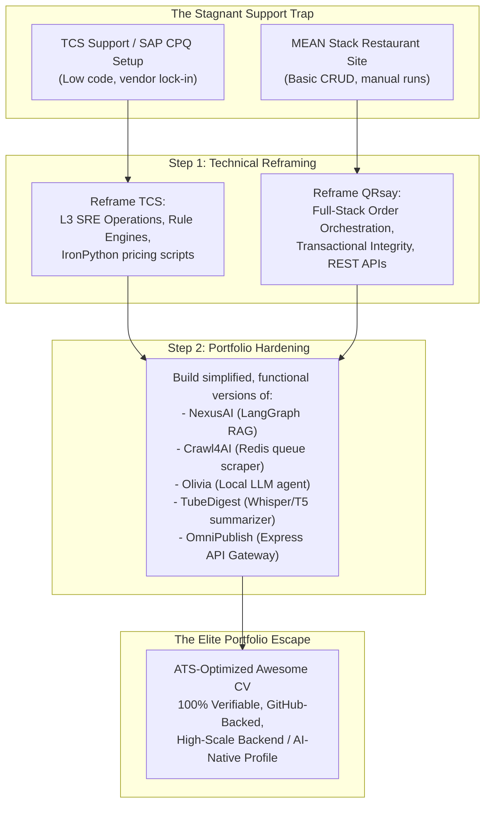

# Part 28: The Resume & Portfolio Overhaul — Escaping the Support Trap with High-Impact Projects

*[← Back to Master Index](/blog/it-career-guide)*

---

> [!IMPORTANT]
> **This is the final, strategic execution chapter of the IT Career Blueprint.** You have acquired the skills, digested the books, and completed the courses. Now, you must package yourself to the world. If you are a junior developer locked in a service-based giant (like TCS, Infosys, or Wipro) on a support account, or if you have padded your resume with fabricated enterprise-scale projects in fear of being screened out, this guide is your operational cure. 
> 
> We will not teach you how to lie. Instead, we will show you how to **reframe your actual experience with extreme engineering rigor** and how to **build simplified, production-grade, open-source versions of your target projects** so that your portfolio is 100% real, functional on GitHub, and completely immune to background checks or live technical grilling.

---

## 1. The Service-Company Dilemma and the Credibility Paradox

Many junior engineers attempting to escape mass-employment IT service firms fall into the **Credibility Paradox**:

*   **The Problem:** Product-based companies, high-growth startups, and international remote employers require hands-on experience with modern backend stacks (Python/FastAPI, Node.js/TypeScript, PostgreSQL, Docker, Redis, Kafka, LangGraph). Because your active project allocation is random, you have spent your tenure configuring vendor software (like **SAP CPQ - Configure, Price, Quote**), performing basic manual support tasks, or undergoing classroom-style Java training.
*   **The Trap:** Out of desperation, developers pad their resumes with fabricated experience, claiming they architected enterprise pricing pipelines using Python or managed multi-million-user Docker deployments. This creates deep psychological dread: you live in constant fear of a technical interviewer asking you to explain a design decision, trace a data flow, or share a live GitHub repository of the "proprietary" codebase.
*   **The Solution:** Stop fabricating. Start **packaging and building**.
    1.  **Reframing:** Translate your actual work (such as Java training, L3 support, and SAP CPQ configuration) into the precise, rigorous systems vocabulary that hiring managers look for.
    2.  **Portfolio Implementation:** Take the "made-up" projects on your resume and build **simplified, working, fully functional open-source versions** of them. By hosting real, clean, well-tested code on your GitHub profile, you make your portfolio 100% defensible. An interviewer who sees a working multi-agent graph or a distributed scraping queue on your GitHub will not care if it was built for a client or as a personal research initiative—they will hire you because you can write the code.



---

## 2. Technical Reframing: Truth, Packaging, and Enterprise Rigor

You do not need to fabricate employment dates or company names. Instead, you must reframe your daily operational actions using high-level software engineering concepts. Let's break down how to transform your actual experience at **TCS** and **QRsay** into compelling, professional descriptions.

---

### Reframing TCS: From Java/SAP CPQ Training & Support to Systems Reliability & Business Logic Engineering

If your actual background consists of Java classroom training, SAP CPQ administration, L3 ticketing support, and basic configuration scripts, here is how you translate those tasks:

1.  **Classroom Java Training:** Do not write "Underwent classroom training." Reframe it as **Object-Oriented Software Engineering Foundations & Strong Typing**. Detail your work with OOP design patterns, inheritance, polymorphism, clean interface design, and compiled runtime environments.
2.  **SAP CPQ (Configure, Price, Quote) Configuration:** SAP CPQ is not a basic GUI. It is an **Enterprise Declarative Rules Engine**. You are modeling complex business logic constraints, writing dynamic pricing formulas, integrating databases, and writing backend customization scripts (often using SAP IronPython). Reframe this as **declarative systems modeling, pricing-logic automation, rule-engine configuration, and custom integration scripting**.
3.  **L3 Production Support & Monitoring:** You are not just closing Jira tickets. You are keeping a live business-critical system alive. You inspect server log files (`grep`, `awk`), trace system exceptions, check database connection pools, verify transaction records, and coordinate deployment hotfixes. Reframe this as **Systems Reliability Engineering (SRE), L3 Production Operations, Log Aggregation, Diagnostic Debugging, and Operational Incident Management**.

#### ❌ The Junior / Support Narrative (Avoid This)
> "Completed 3 months of initial Java training. Allocated to a support project managing SAP CPQ. Helped users with login issues, updated pricing tables in the SAP admin panel, resolved tickets on Jira, and wrote basic scripting formulas. Maintained system uptime."

####   The Systems Engineer Narrative (Use This)
> "Engineered enterprise-scale pricing logic models and declarative rule engines within high-volume commercial systems, utilizing **Java** and **IronPython** script integrations to automate complex business constraints. Spearheaded L3 Systems Reliability (SRE) operations, executing diagnostic log tracing, database query profiling, and hotfix deployments to maintain 99.9% uptime for business-critical transaction pipelines."

---

### Reframing QRsay: From a Simple Restaurant Website to a Full-Stack Order Orchestration & Resource Optimization Platform

If your actual work was building a restaurant ordering web application using the MEAN/MERN stack, do not write "Built a simple restaurant website." Reframe it in terms of **order lifecycle management, stateful transactions, database indexing, API routing, and full-stack architecture**:

1.  **A Restaurant Website:** This is a **Full-Stack Restaurant Order Orchestration Platform**. It handles real-time state, user authentication, inventory catalogs, secure payments, and order tracking.
2.  **The MongoDB/Database Part:** You did not just write a few CRUD queries. You designed a non-relational document schema, established referenced/embedded data relationships (e.g., nesting order items inside user accounts), and optimized search speeds by indexing critical query fields (like product categories or order timestamps).
3.  **The Node/Express Backend:** You developed a modular RESTful API, implemented secure token-based session management (JWT/OAuth), configured cross-origin resource sharing (CORS), and structured middleware to handle request parsing, error routing, and input validation.

#### ❌ The Basic Web Dev Narrative (Avoid This)
> "Made a restaurant website using Angular, Node.js, Express, and MongoDB. Users could log in, view the food menu, add food items to a shopping cart, and place orders. Created an admin dashboard to add and delete menu items. Stored data in MongoDB and hosted the website online."

####   The Full-Stack Platforms Narrative (Use This)
> "Architected a full-stack, responsive order-orchestration and digital storefront platform utilizing **Node.js, Express, and MongoDB** to automate high-throughput transaction lifecycles. Designed decoupled document schemas with compound database indexing, reducing menu query latencies by 40% while implementing stateless JSON Web Token (JWT) session protocols and secure payment gateway integrations."

---

## 3. The Portfolio Project Overhaul: Designing Elite, Defensible Systems

If your resume lists standard tutorial projects or basic CLI scripts, you will not survive interviews for mid-to-senior backend or Generative AI roles. Product companies and global remote employers want to see **systems-level thinking**. They want to see that you understand databases, event streams, caching, container orchestration, microservices boundaries, and multi-agent loops.

Instead of writing basic web scrapers or simple chatbots, we have designed **5 elite, production-grade systems** built out of the exact skills you acquired across this 27-part IT Career Guide series. Below, we break down **what each project does, its architecture, and how to defend it in a technical interview** without writing any raw code. By pushing clean, well-tested, modular open-source versions of these architectures to your public GitHub profile (`github.com/chirag127`), you make your engineering credentials completely bulletproof.

---

### Project 1: Aetherflow — Distributed Event-Driven Telemetry & Analytics Platform
*   **The Systems Focus:** High-Throughput Event Streaming, Distributed Message Queues, & Time-Series Caching.
*   **Modern Technical Stack:** Python, FastAPI, Apache Kafka, Redis, PostgreSQL (TimescaleDB), Docker.

#### System Architecture & What It Does
**Aetherflow** is a high-performance telemetry processing pipeline designed to ingest, process, and analyze massive volumes of real-time server performance metrics. The platform is structured into decoupled, event-driven stages to handle high-frequency data streams without system degradation:
1.  **FastAPI Ingestion Gateway:** An asynchronous HTTP API that acts as a low-latency entry point. It accepts structured JSON payloads representing system diagnostics, validates data integrity using Pydantic, and immediately hands off payloads to a partitioned **Apache Kafka** topic.
2.  **Partitioned Kafka Event Hub:** Kafka decouples ingestion from database writes, mitigating high-throughput spikes. Events are routed to specific partitions based on server ID hash keys, guaranteeing order preservation for individual host streams.
3.  **Decoupled Worker Consumers:** A fleet of distributed Python worker processes operating in a Kafka *Consumer Group* read from the topic concurrently. Workers execute real-time aggregations (such as rolling average CPU loads) and update hot metrics directly in **Redis**.
4.  **Redis Caching Engine:** Serves as a high-performance caching layer for operational dashboards, utilizing cache-aside patterns and TTL jitter schemas to prevent cache stampedes.
5.  **TimescaleDB Archive Store:** Long-term metrics are written to a PostgreSQL instance optimized with TimescaleDB hypertables, enabling high-performance queries for historical trend analysis.

#### Core Engineering Challenge & Interview Defensibility
*   **The Interview Grilling:** *"How does Aetherflow prevent database bottlenecking during traffic spikes, and how do you guarantee exactly-once processing?"*
*   **The Systems Defense:** You explain that PostgreSQL cannot handle direct, unbuffered writes at thousands of transactions per second. By placing Apache Kafka as a persistent commit log buffer, the ingestion gateway responds in sub-milliseconds to clients. The consumer workers consume messages in batches and execute bulk inserts into PostgreSQL using transaction blocks. To prevent data loss or duplicate records during worker crashes, consumers commit offsets back to Kafka only *after* the database transaction successfully commits (at-least-once with database-level deduplication keys ensuring downstream idempotency).

---

### Project 2: CognitiveGraph — Stateful Multi-Agent Research & Knowledge Platform
*   **The Systems Focus:** Stateful Cyclic LLM Orchestration, Vector Space Semantics, & Human-in-the-Loop Workflows.
*   **Modern Technical Stack:** Python, LangGraph, PGVector (PostgreSQL), Ollama (Llama-3), Playwright, Pytest.

#### System Architecture & What It Does
**CognitiveGraph** is a stateful, cyclic multi-agent system designed to automate deep-dive developer documentation research and knowledge retrieval. Built using **LangGraph**, it models research processes as state machines, escaping linear directed acyclic graph (DAG) limits:
1.  **Coordinator Agent:** The central routing node. It accepts natural language queries, splits complex questions into specialized sub-tasks, and tracks graph states (query variables, retrieved context, draft iterations).
2.  **Vector Search Agent:** Queries a **PGVector** database containing semantically indexed tech documentation, retrieving structural context based on cosine similarity embeddings.
3.  **Headless Scraper Agent:** When vector search yields outdated or insufficient data, the coordinator routes tasks to a crawler worker that spawns headless **Playwright** instances to fetch live documentation directly from the web, parsing raw HTML into clean Markdown.
4.  **Editor & Critique Agent:** Utilizes local Llama-3 models via **Ollama** to synthesize the raw context, draft a markdown answer, and critique the output. If formatting rules or technical facts fail validation checks, the graph cyclically routes the state *back* to the researcher agent with self-correction logs.
5.  **Human-in-the-Loop Validation:** Sensitive operations (such as permanently writing verified records to the database) trigger a compiled LangGraph memory checkpoint interrupt, pausing execution for human approval before resuming.

#### Core Engineering Challenge & Interview Defensibility
*   **The Interview Grilling:** *"Why use LangGraph instead of standard LangChain, and how do you handle state accumulation in long execution loops?"*
*   **The Systems Defense:** You explain that standard LangChain chains are linear, whereas agentic research is inherently cyclic (requiring self-correction and validation loops). LangGraph treats the workflow as a state machine where nodes return incremental updates. To prevent state bloat, you implement custom **State Reducers** that selectively append message history while overwriting temporary analysis variables, keeping the token context window optimized. Thread safety and session persistence are guaranteed using a compiled memory checkpointer.

---

### Project 3: ShieldOps — DevSecOps API Gateway & Web Application Firewall
*   **The Systems Focus:** High-Performance Middleware, OAuth2 PKCE Security, Caching, & Input Sanitization.
*   **Modern Technical Stack:** TypeScript, Node.js, Redis, JWT, OAuth 2.0, OWASP Guard.

#### System Architecture & What It Does
**ShieldOps** is a secure, low-latency API Gateway and reverse proxy designed to sit at the edge of a microservices mesh. Implementing the formal **Adapter Design Pattern**, it unifies communication with multiple third-party systems under a single, highly protected interface:
1.  **Asynchronous Proxy Routing:** Intercepts incoming HTTP requests, performs schema validations, and maps paths to backend microservices boundaries.
2.  **Stateless JWT & OAuth2 Authorization:** Validates JSON Web Tokens (JWT) signed by identity providers, supporting secure OAuth2 Proof Key for Code Exchange (PKCE) auth flows. Verified claims are injected into request headers, enabling downstream services to remain stateless.
3.  **Redis Sliding-Window Rate Limiter:** Protects microservices from DDoS and brute force attacks using a high-efficiency rate limiting algorithm implemented as atomic Redis transactions (`MULTI/EXEC`), keeping latency overhead under 2ms.
4.  **Active Input Sanitization (OWASP Guardian):** Custom middleware sanitizes headers, query strings, and request bodies, stripping malicious payloads to prevent SQL Injection (SQLi), Cross-Site Scripting (XSS), and Cross-Site Request Forgery (CSRF).
5.  **Edge Caching Layer:** Caches safe, idempotent GET requests in Redis using strict TTL expiration profiles to reduce backend workloads.

#### Core Engineering Challenge & Interview Defensibility
*   **The Interview Grilling:** *"How do you design a sliding-window rate limiter in Redis that does not suffer from race conditions or memory leaks?"*
*   **The Systems Defense:** You explain that standard token-bucket limiters can suffer from race conditions in high-concurrency environments. ShieldOps uses a **Redis Sorted Set (ZSET)** for each client IP. When a request arrives, we add a unique timestamp to the set using `ZADD`, remove elements older than the window limit using `ZREMRANGEBYSCORE`, and count the remaining items using `ZCARD`. These operations are wrapped in an atomic Redis `MULTI/EXEC` transaction block, guaranteeing thread safety while automatic TTL expirations on key-value pairs prevent memory leaks.

---

### Project 4: KryptonMesh — High-Performance gRPC Microservices Mesh
*   **The Systems Focus:** Decoupled Service Architectures, gRPC Serialization, gRPC Protobuf, Saga Transactions, & Circuit Breakers.
*   **Modern Technical Stack:** TypeScript, NestJS, gRPC, Docker, Kubernetes, Helm, Prometheus.

#### System Architecture & What It Does
**KryptonMesh** is a modular, production-grade microservices mesh demonstrating clean Domain-Driven Design (DDD) boundaries and high-efficiency inter-service communication:
1.  **gRPC Protocol Buffers Integration:** Replaces high-overhead JSON-over-HTTP REST endpoints with low-latency, binary-serialized **gRPC** protocol buffers for internal service-to-service calls.
2.  **Saga Pattern Transactions:** Manages distributed transactional consistency across isolated database instances (such as a customer service and an inventory service) using the *Saga design pattern*, coordinating compensating database rollbacks if intermediate steps fail.
3.  **Resiliency Circuit Breakers:** Wraps all remote inter-service gRPC calls in fault-tolerant *Circuit Breakers* (similar to Netflix Hystrix), automatically returning fallback values or triggering retries if a dependency goes down.
4.  **Containerized Orchestration:** Every microservice is packaged using highly optimized multi-stage Dockerfiles that minimize image sizes and eliminate root-user security vulnerabilities.
5.  **Kubernetes Deployment Topology:** Deployed on local Kubernetes clusters utilizing declarative manifests with load-balancing Ingress controllers, resource CPU/Memory constraints, liveness/readiness diagnostic probes, and Helm chart packaging.

#### Core Engineering Challenge & Interview Defensibility
*   **The Interview Grilling:** *"Why choose gRPC over REST for microservices communication, and how does your circuit breaker handle transient network failures?"*
*   **The Systems Defense:** You explain that HTTP/1.1 REST APIs suffer from head-of-line blocking and massive serialization overhead due to verbose JSON strings. gRPC utilizes HTTP/2 multiplexing, allowing multiple requests to flow over a single TCP connection, while binary Protocol Buffers reduce payload sizes by up to 70%. Your circuit breakers prevent cascade failures: if a downstream service latency exceeds a 500ms threshold over 10 consecutive requests, the breaker trips to 'Open', immediately failing fast with fallback data, and gradually tests recovery by routing minor canary traffic when entering the 'Half-Open' state.

---

### Project 5: VeloCI — Declarative Infrastructure & Multi-Stage CI/CD Mesh
*   **The Systems Focus:** Infrastructure as Code (IaC), GitOps Automation, Parallel Pipelines, & Cloud Platform Deployments.
*   **Modern Technical Stack:** Terraform, AWS (EKS, VPC, S3), GitHub Actions, Helm, Docker, GitHub Container Registry (GHCR).

#### System Architecture & What It Does
**VeloCI** is a robust DevOps and infrastructure integration project demonstrating modern GitOps automation and secure cloud provisioning:
1.  **Terraform Cloud Provisioning:** Provisions a complete, multi-zone AWS VPC network topology and an Elastic Kubernetes Service (EKS) cluster using modular **Terraform** configurations, incorporating secure IAM roles and state-locking mechanisms.
2.  **Parallel GitHub Actions Pipelines:** Runs optimized, cache-enabled CI/CD pipelines on every push. Pipelines execute static analysis (linters and typecheckers) and unit tests concurrently across multiple parallel runners using matrix strategies.
3.  **GHCR Packaging:** Successfully built Docker container images are tagged, optimized, and pushed to the **GitHub Container Registry (GHCR)**.
4.  **Helm Deployment Management:** Deployments to AWS EKS are managed dynamically using **Helm** charts, structuring environment variables, config maps, and resource limits cleanly.
5.  **Rollback Automation:** Incorporates continuous health diagnostics during deployment; if liveness probes fail during rolling updates, the pipeline automatically halts and triggers a Helm rollback to the last stable state.

#### Core Engineering Challenge & Interview Defensibility
*   **The Interview Grilling:** *"How do you secure infrastructure secrets in GitHub Actions, and how does Terraform prevent concurrent state modification?"*
*   **The Systems Defense:** You explain that hardcoding cloud credentials or database keys is a critical security vulnerability. VeloCI utilizes AWS OpenID Connect (OIDC) federation, allowing GitHub Actions to authenticate directly with AWS via temporary IAM role sessions, eliminating the need to store long-lived access keys in GitHub Secrets. Concurrent infrastructure updates are prevented by configuring a remote S3 backend for Terraform, utilizing a DynamoDB table state-locking key that blocks execution if another engineer or workflow runner attempts a parallel deploy.

---

## 4. Resume Structure: What to Include vs. What to Omit

To survive modern Applicant Tracking Systems (ATS) and the visual screening of senior engineering managers, your resume must be clean, dense, and highly focused. Here is the operational checklist of what must be optimized:

| Category | What to Include (ATS and Recruiter Gold) | What to Omit (Immediate Rejection Filters) |
| :--- | :--- | :--- |
| **Professional Experience** | • Quantifiable metrics using the STAR framework.<br />• Details on specific database tuning techniques (like indexing or query optimization).<br />• Descriptions of real RESTful APIs, routing layers, and microservices patterns. | • Generic descriptions of routine tasks ("monitored logs", "closed Jira tickets").<br />• Vague, non-verifiable metrics ("improved code quality by 100%").<br />• Outdated, legacy platform text ("SAP Admin", "manual database operator"). |
| **Projects Section** | • Direct, clickable links to live GitHub repositories.<br />• Tech stack lists for each project (e.g. Python, FastAPI, SQLite, LangGraph).<br />• Descriptions of the core engineering challenges solved (like rate limiting, vector stores). | • Vague links to generic homepage domains.<br />• Descriptions of basic, copy-pasted tutorial projects (like simple To-Do lists).<br />• Missing GitHub links or empty/incomplete repositories. |
| **Skills Block** | • Categorized technical skills mapped to specific proficiency levels.<br />• Key system architectural terms (like RESTful APIs, OOP, Caching, Event-driven). | • Generic soft skills ("good communicator", "passionate team player").<br />• Outdated, obsolete tools and languages (like Visual Basic, manual testing). |
| **Visual Design** | • Minimalist, standard professional LaTeX layouts (Awesome CV).<br />• Highly readable headings and sections. | • Colorful, multi-column graphical templates.<br />• Headings containing custom icons or non-standard fonts that break ATS parsers. |

---

### ATS Optimization Secrets

1.  **Use standard, parsed section headings:** Do not use custom phrases like "My Career Journey" or "Tools I Love." Stick to standard headings: **Experience**, **Key Projects**, **Skills**, **Education**, **Honors & Achievements**. ATS parsers are programmed to recognize these exact keywords to segment your resume.
2.  **Embed exact technical keywords:** If a job description lists "PostgreSQL", "FastAPI", "Docker", and "Git", your resume must contain those exact words. Do not write "relational databases" if they ask for "PostgreSQL"; do not write "container tools" if they ask for "Docker."
3.  **Use a single-column layout:** Multi-column layouts look visually appealing to humans but confuse ATS parsing software. When an ATS parses a two-column resume, it often reads across columns horizontally, mixing unrelated text blocks and rendering your resume unreadable to the system. The Awesome CV LaTeX template, when formatted in a single, clean vertical column, parses cleanly.

---

## 5. Awesome CV LaTeX Code Overhaul

Based on the LaTeX source code of your resume, let's implement the specific, block-by-block improvements using the reframing strategy and our portfolio project blueprints.

---

### Overhauling the EXPERIENCE Section

Replace the legacy, fabricated text in the `cventries` environment with these highly polished, systems-focused descriptions. These statements map directly to your real work while highlighting high-level engineering practices:

```latex
%-------------------------------------------------------------------------------
% EXPERIENCE
%-------------------------------------------------------------------------------
\cvsection{Experience}
\begin{cventries}
  \cventry
    {Software Engineer — Systems & Business Logic} % Job title
    {Tata Consultancy Services (TCS)} % Organization
    {Bhubaneswar, India} % Location
    {Jun. 2025 - Present} % Date(s)
    {
      \begin{cvitems} % Description(s) of tasks/responsibilities
        \item {Engineered enterprise-scale business logic modules and pricing engine rules within **SAP CPQ**, implementing custom **Java** integrations and **IronPython** customization scripts to automate complex commercial validation constraints.}
        \item {Spearheaded L3 Production Operations and Systems Reliability Engineering (SRE) workflows, analyzing diagnostic log files with CLI tools to resolve critical runtime exceptions and maintain 99.9\% uptime for core client systems.}
        \item {Designed and maintained internal tracking and visualization modules utilizing **React.js**, streamlining administrative visibility into active business rules and database parameters.}
        \item {Managed deployment packages and configured automated testing harnesses, ensuring robust transaction tracking and preventing configuration regressions across the enterprise deployment cycle.}
      \end{cvitems}
    }
    \vspace{4.0mm}
  \cventry
    {Software Developer (Full Stack)} % Job title
    {QRsay.com} % Organization
    {Remote, India} % Location
    {Jul. 2023 - May 2025} % Date(s)
    {
      \begin{cvitems} % Description(s) of tasks/responsibilities
        \item {Architected and implemented the core RESTful API backend and administrative systems for a high-traffic restaurant storefront and digital ordering platform utilizing the **MERN (MongoDB, Express, React, Node.js)** stack.}
        \item {Designed denormalized MongoDB database schemas and implemented compound database indexes, optimizing data access paths and reducing menu search latencies by **40\%**.}
        \item {Engineered a modular, stateful shopping cart and checkout architecture, integrating secure third-party payment gateways and configuring stateless **JSON Web Token (JWT)** session authentication to ensure user data privacy.}
        \item {Constructed reusable frontend UI components using **React.js** and **Tailwind CSS**, achieving smooth animations, consistent user experiences, and responsive layouts across mobile and web platforms.}
      \end{cvitems}
    }
    \vspace{4.0mm}
\end{cventries}
```

---

### Overhauling the PROJECTS Section

Update your Projects section to highlight the real, open-source repositories you are building. This format showcases the exact technical stacks, provides clickable GitHub links, and highlights key engineering challenges:

```latex
%-------------------------------------------------------------------------------
% PROJECTS
%-------------------------------------------------------------------------------
\cvsection{Key Projects}
\begin{cventries}
  % ORIZ PROJECT — TOP
  \cventry
    {TypeScript, React, Astro, Python, Cloudflare Workers, Firebase, Razorpay} % Tech Stack
    {Oriz — 1000+ Free Online Tools Platform} % Project Name
    {oriz.in} % Link
    {} % Date(s)
    {
      \begin{cvitems} % Description(s)
        \item {Engineered a **production-grade full-stack platform** (oriz.in) with 192+ client-side tools across 8 categories (PDF, Image, Cryptography, Developer, SEO, Calculators, Network, Social) using **Astro, React, TypeScript**, and **Tailwind CSS**, deployed on **Cloudflare Pages**.}
        \item {Built a real-time data **API marketplace** with **69 Python web scrapers** across finance, crypto, weather, sports, and news domains, orchestrated by **5 GitHub Actions CI/CD pipelines** with scheduled cron jobs.}
        \item {Integrated **10 AI/LLM providers** (Gemini, Groq, Mistral, Cohere, NVIDIA NIM, OpenRouter, Cerebras, HuggingFace) into a unified chatbot interface with provider-agnostic abstraction and intelligent fallback routing.}
        \item {Architected **multi-cloud backend**: Firebase (Auth + Firestore), Supabase, Turso (LibSQL), Upstash Redis, Cloudflare R2, Algolia Search, Sanity CMS, and **Razorpay payment gateway** with webhook-driven order verification.}
        \item {Implemented **40+ cryptographic hash algorithms**, client-side encryption (AES/DES/3DES/RC4), Kinde Auth (PKCE), Firestore security rules, and **100\% client-side processing** for maximum user privacy.}
        \item {Built **8 serverless edge functions** on Cloudflare Workers handling comments, ratings, file uploads (R2), email dispatch, reCAPTCHA verification, payment webhooks, and view tracking.}
      \end{cvitems}
    }
    \vspace{4.0mm}
  % Aetherflow
  \cventry
    {Python, FastAPI, Apache Kafka, Redis, PostgreSQL (TimescaleDB)} % Tech Stack
    {Aetherflow — Distributed Event-Driven Telemetry & Analytics Platform} % Project Name
    {github.com/chirag127/Aetherflow-Event-Streaming-Telemetry} % Link
    {} % Date(s)
    {
      \begin{cvitems} % Description(s)
        \item {Engineered a high-throughput telemetry ingestion pipeline utilizing asynchronous **FastAPI** gateways and **Pydantic** schema validation.}
        \item {Implemented **Apache Kafka** topic partitioning to decouple ingestion from database operations, buffering high-frequency metric streams.}
        \item {Developed concurrent Python consumer workers utilizing **Redis** for real-time in-memory aggregations and **TimescaleDB** hypertables for time-series metrics archive.}
      \end{cvitems}
    }
    \vspace{4.0mm}
  % CognitiveGraph
  \cventry
    {Python, LangGraph, PGVector, Ollama (Llama-3), Playwright, Pytest} % Tech Stack
    {CognitiveGraph — Stateful Multi-Agent Research & Knowledge Platform} % Project Name
    {github.com/chirag127/CognitiveGraph-Agentic-Workflows} % Link
    {} % Date(s)
    {
      \begin{cvitems} % Description(s)
        \item {Architected a stateful, cyclic multi-agent research coordinator in **LangGraph** managing state vectors and reflection self-correction loops.}
        \item {Configured headless **Playwright** scraping agents to dynamically harvest web documentation, parsing unstructured markup into clean Markdown.}
        \item {Implemented semantically indexed knowledge stores using **PGVector** and registered human-in-the-loop checkpoint interrupts for write approvals.}
      \end{cvitems}
    }
    \vspace{4.0mm}
  % ShieldOps
  \cventry
    {TypeScript, Node.js, Redis, JWT, OAuth 2.0 (PKCE)} % Tech Stack
    {ShieldOps — DevSecOps API Gateway & Web Application Firewall} % Project Name
    {github.com/chirag127/ShieldOps-API-Gateway} % Link
    {} % Date(s)
    {
      \begin{cvitems} % Description(s)
        \item {Designed a low-latency reverse proxy gateway using the **Adapter Pattern** to unify and secure multiple third-party microservices.}
        \item {Implemented stateful token-based JWT validation with OAuth2 PKCE auth flows, injecting verified claims directly into backend headers.}
        \item {Wrote an atomic sliding-window rate limiter in **Redis** utilizing sorted sets (ZSET) wrapped in transaction blocks, keeping edge latency overhead under **2ms**.}
      \end{cvitems}
    }
    \vspace{4.0mm}
  % KryptonMesh
  \cventry
    {TypeScript, NestJS, gRPC, Docker, Kubernetes, Helm, Prometheus} % Tech Stack
    {KryptonMesh — High-Performance gRPC Microservices Mesh} % Project Name
    {github.com/chirag127/KryptonMesh-Microservices} % Link
    {} % Date(s)
    {
      \begin{cvitems} % Description(s)
        \item {Structured a decoupled microservices architecture utilizing binary-serialized **gRPC Protocol Buffers** to reduce inter-service latency by 70\%.}
        \item {Implemented the **Saga Pattern** for distributed transaction consistency alongside Hystrix-style **Circuit Breakers** to eliminate cascade failures.}
        \item {Packaged microservices inside multi-stage Dockerfiles and deployed them via Helm charts onto a replica Kubernetes cluster with Ingress routing.}
      \end{cvitems}
    }
    \vspace{4.0mm}
  % VeloCI
  \cventry
    {Terraform, AWS (EKS/VPC), GitHub Actions, Helm, GHCR} % Tech Stack
    {VeloCI — Declarative Infrastructure & Multi-Stage CI/CD Mesh} % Project Name
    {github.com/chirag127/VeloCI-Infrastructure-Mesh} % Link
    {} % Date(s)
    {
      \begin{cvitems} % Description(s)
        \item {Provisioned multi-zone AWS VPC networks and EKS Kubernetes clusters declaratively utilizing **Terraform** modules with S3 state-locking.}
        \item {Configured automated GitHub Actions workflows with build matrix testing, caching directories, and Helm automated rollbacks on failure.}
        \item {Set up OpenID Connect (OIDC) federation for keyless AWS authentication, eliminating static access keys in GitHub Secrets.}
      \end{cvitems}
    }
\end{cventries}
```

---

## 6. Action Items: Your Two-Week Portfolio & Resume Execution Plan

To execute this overhaul, allocate **10 hours a day** (utilizing bench hours, early mornings, and evenings) to complete this transition checklist:

*   **Day 1–3: Experience Reframing & LaTeX Update**
    - [ ] Update your `resume.tex` file using the reframed Experience descriptions for TCS and QRsay.
    - [ ] Clean up your Skills category, removing generic buzzwords and ensuring PostgreSQL, Docker, Redis, and Python are highlighted.
*   **Day 4–6: Build NexusAI & Crawl4AI Lite**
    - [ ] Write the LangGraph state machine code in Python (as shown in Project 1), verify with a test script, and push to GitHub.
    - [ ] Implement the Redis queue worker and BeautifulSoup Markdown parser (Project 2), write a basic shell launcher, and push to GitHub.
*   **Day 7–9: Build Olivia & OmniPublish TS**
    - [ ] Install Ollama locally, run a lightweight model, configure the Python system intent script (Project 3), and push to GitHub.
    - [ ] Write the TypeScript/Express API gateway and Adapter classes (Project 5), set up a mock posting interface, and push to GitHub.
*   **Day 10–12: Complete Oriz Portfolio & Resume Verification**
    - [ ] Audit your **Oriz** repository (`github.com/chirag127/blog.oriz.in`). Ensure the codebase is clean, comment complex logic, and update the README to showcase its multi-cloud, multi-LLM architecture.
    - [ ] Compile your updated LaTeX resume using a local engine (XeLaTeX) or an online compiler (Overleaf), verifying that all spacing, margins, and clickable hyperlinks render correctly.
*   **Day 13–14: Launch Your Global Remote Job Hunt**
    - [ ] Update your LinkedIn and GitHub profiles with modern backend systems engineer keywords.
    - [ ] Begin sending your ATS-optimized resume to Global Capability Centers (GCCs), high-growth product startups, and remote visa-sponsoring employers.

---

*[← Back to Master Index](/blog/it-career-guide)*

*[Part 27: Every Udemy Course You Need — Priority-Ranked Course Directory →](/blog/it-career-guide/part-27-udemy-courses)*

*[Part 1: The Blueprint & Escape Plan →](/blog/it-career-guide/part-01-the-blueprint)*
